# Reaper: illustrated workshop build guide

## Build the Reaper

Finished shape with the owned 9045 three-blade propeller shown as a reference. Fit your three wheel assemblies to the plain legs; their dimensions are not modelled.

| Before you build | What we know |
| --- | --- |
| Size / estimated flying weight | 2.0 m span / 2.55 kg including flight battery. Build sensitivity: 2.12-3.15 kg. Weigh the finished model. |
| Estimated stall speed | 38-49 km/h (10.6-13.7 m/s), at 2.55 kg under stated lift/air-density assumptions. Not a measured flight speed. |
| Flight time example | 15-17 minutes IF whole-flight average current is 15 A. Actual current is unknown; see next page. |
| Runway / launch | Required runway length is UNKNOWN. Planned method: wheeled roll from a smooth runway after ground testing. No qualified hand launch or catapult. |

**Resolve before a powered launch** The Emax 2807 motor is listed for 7-inch props. The owned 9-inch three-blade combination has no verified current, thrust or temperature result. The build files do not establish flight readiness.

## Flight numbers, without guessing

Battery time: capacity divided by average current

4S 5200 mAh = 5.2 Ah, about 77 Wh at nominal voltage. The examples use 70-80% of rated capacity and leave 20-30% unused. Pack condition and voltage sag may shorten them.

| Assumed whole-flight average | Calculated time |
| --- | --- |
| 10 A | 21.8-25.0 min |
| 15 A | 14.6-16.6 min |
| 20 A | 10.9-12.5 min |
| 25 A | 8.7-10.0 min |

Minutes = 60 x 5.2 x usable fraction / average amperes. Include launch, climb, servos and electronics. These are conditional examples, not a prediction of cruise current.

Stall: the slowest speed assumed to hold level flight

Wing area is 0.304 m2; loading is about 83.7 g/dm2. Vs = square root of [2 x mass x gravity / (air density x wing area x maximum lift coefficient)]. Assumed maximum lift coefficient: 0.8-1.2; air density: 1.10-1.225 kg/m3.

38-49 km/h is airspeed, not GPS ground speed. Turns, gusts and a heavier build raise the requirement. Including the full mass sensitivity gives about 35-55 km/h. Do not target stall during the maiden flight.

Runway: no defensible minimum yet

| Illustration only: reach 18 m/s in still air | Ground roll only |
| --- | --- |
| Assume 1 m/s2 net acceleration | 162 m |
| Assume 2 m/s2 net acceleration | 81 m |
| Assume 3 m/s2 net acceleration | 54 m |

Distance = speed squared / (2 x net acceleration). Acceleration is unmeasured. These examples exclude obstacle clearance, climb and stopping after an aborted takeoff. 18 m/s is not an approved takeoff speed.

**Launch plan** First prove propulsion, structure, balance and straight low-speed rolling. An experienced RC pilot then sets the operating speeds, field and abort plan. Do not chase these example speeds in an unqualified ground run.

## The whole job at a glance

| Order | Do this | Files in this package |
| --- | --- | --- |
| 1  CUT WOOD | 33 plywood + 38 balsa pieces. Count 71. | Cutting/ sheet DXFs; Cutting/Part_to_Sheet.csv |
| 2  CUT FOAM | 35 flat patterns. Knife or CNC knife; form and trim inner pockets by hand. | Cutting/ foam sheet DXFs; individual files in Reference_Profiles/ |
| 3  PRINT | 14 new PLA+ parts. Reuse the existing N1 nose. | Print/ individual STLs; Print/Print_Schedule.csv |
| 4  DRY-FIT + GLUE | Body -> wing beams -> ribs/skins -> tail/controls -> covers/legs. | Illustrated steps in this guide; CAD/Reaper_Assembly.step |
| 5  FIT + WIRE | Owned electronics, four servos, four spokes, two whole carbon rods, three wheel assemblies. | Placement, wiring and setup pages below |
| 6  CHECK | Count, fit, balance, electrical tests, propulsion test and supervised ground checks. | Data/Guide_Parts_Checklist.csv; Data/Physical_Checks.csv |

**One checklist for the workshop** Data/Guide_Parts_Checklist.csv lists every cut pattern and new print, quantity, individual file and cutting sheet. Tick it as parts arrive. Individual reference profiles are alternatives to sheet layouts, not extra parts.

Find the next job

Parts and cutting: pages 4-15.
Assembly and intermediate pictures: pages 16-31.
Electronics placement, wiring and setup: pages 32-39.
Balance and launch checks: pages 40-41. Terms: page 42.

CAD = the positioned 3D model. DXF = a flat cutting file. STL = a print mesh. R and L mean aircraft right and left when looking forward from the tail. All files use millimetres at 100% scale.

## Lay out the stock and owned parts

| Have ready | Use |
| --- | --- |
| 6 mm plywood, 8 x 4 ft | One 2438.4 x 1219.2 mm layout; 33 parts. Measure actual thickness first. |
| Ten 1000 x 100 x 5 mm balsa planks | Two nested planks; 38 parts. Keep the layout grain direction. |
| Ten 1000 x 600 mm FliteBoard sheets | Three nested sheets; 35 flat patterns. Measure thickness and sheet mass. |
| Two solid 5 x 1000 mm carbon rods | Use one full rod in each wing. Do not make short centre joiners. |
| 2 kg HS PLA+ / existing N1 nose | About 582 g for new prints with estimated supports/brims. Reuse N1. |
| Five MG90S / four bicycle spokes | Fit four servos and four spokes; one servo stays spare. Keep factory arms/screws. |
| Three wheel/axle assemblies | Reuse the supplied wheels and axle hardware. Three plain plywood legs. |
| Two straps / ties / tape / adhesive | Two battery straps; tape hinges/covers; tested joints and simple equipment retention. |

Tools: ruler/caliper, square, knife, sanding block, drill/reamer, scale, soldering tools, multimeter and wattmeter. Use motor/prop supplied hardware; no new generic fastener kit is specified.

**Make three trials first** Test stock-slot fit; a formed wing section with its deepest beam pocket; and real wood/carbon/foam/PLA adhesive joints. Use foam-safe glue on exposed foam. Thin, fitted joints beat large glue blobs.

## Cut once, label every piece

1.  Give the shop Cutting/Sheet_Register.csv, Part_to_Sheet.csv and the matching DXFs. Keep every part ID on its cut piece.

2.  Measure plywood, balsa and foam. Test the cutting width (kerf) and slot fit on an offcut before the complete sheet.

3.  CUT means through-cut. SCORE needs a separate controlled pass. MARK labels pieces. Never cut STOCK_REFERENCE_DO_NOT_CUT.

4.  If the laser bed is smaller, re-nest whole individual profiles from Reference_Profiles/. Keep scale at 100%. Do not split a structural part just to fit the bed.

5.  Use knife/CNC-knife for the paper-faced foam unless the shop has established a suitable process. Protect the outer paper; internal pockets are hand-fit later.

6.  Count 33 plywood + 38 balsa + 35 foam patterns. Tick the checklist. Add one tiny hand-shaped FNT foam offcut (13 x 7 mm) during nose fitting.

**Grain and finishing matter** Keep balsa grain along the long stock direction shown. Keep root-tongue plywood face grain along the wing span. Some laser-cut blanks still need grooves or sanding: use CAD/Stock_Blanks for the starting shape and CAD/Parts for the finished shape.

Optional paper cutting

Paper_Patterns.pdf is a tiled, actual-size template set. Find the needed part in Data/Paper_Page_Map.csv. Print only those pages at Actual Size / 100%; measure the scale bar before cutting. Do not print all 180 pages by default.

## Wing wood parts / both wings

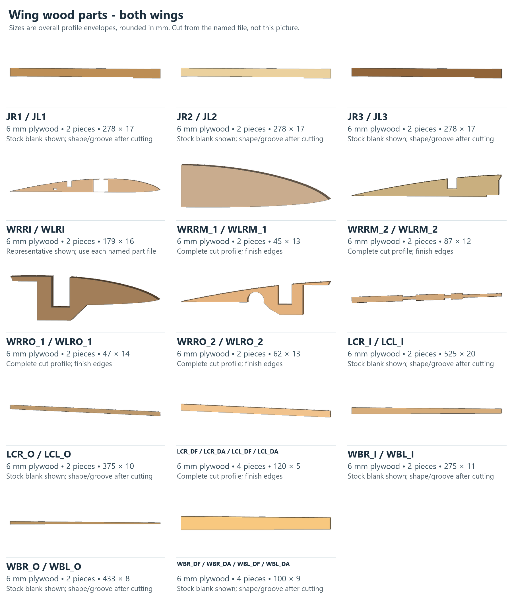

Each listed ID is one piece. Paired groups may show one representative; use each named file and pick every ID listed. Images are not cutting templates.

Match IDs to Data/Guide_Parts_Checklist.csv. Wood pictures marked as blanks still need the finishing operation. N1 is reused, not part of the 14 new prints.

## Tail and landing-leg wood parts

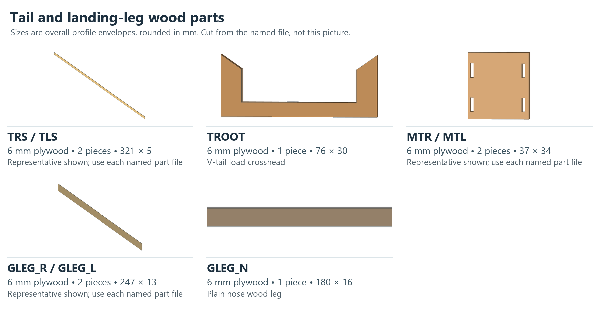

Each listed ID is one piece. Paired groups may show one representative; use each named file and pick every ID listed. Images are not cutting templates.

Match IDs to Data/Guide_Parts_Checklist.csv. Wood pictures marked as blanks still need the finishing operation. N1 is reused, not part of the 14 new prints.

## Printed parts / 14 new prints + reuse N1

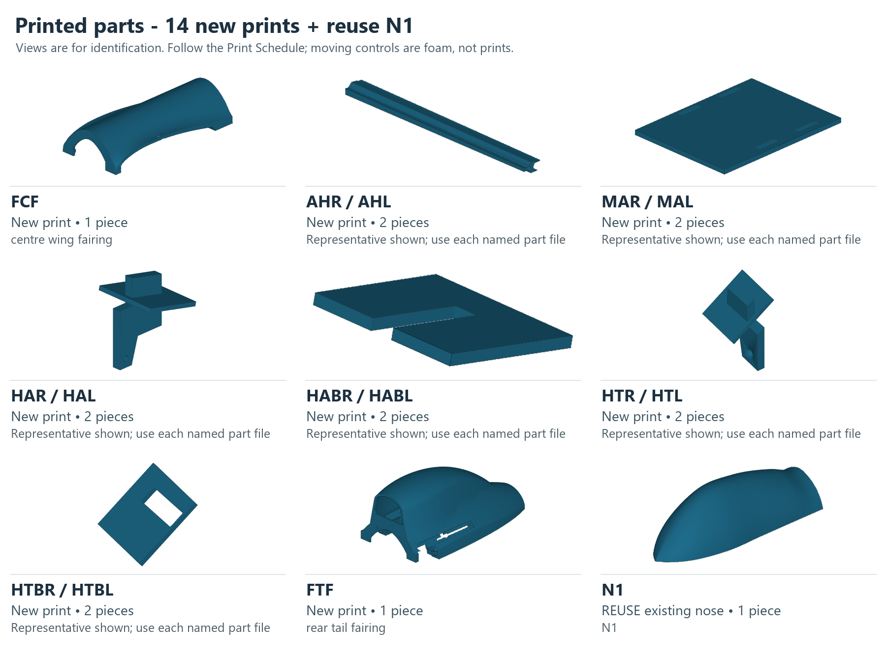

Each listed ID is one piece. Paired groups may show one representative; use each named file and pick every ID listed. Images are not cutting templates.

Match IDs to Data/Guide_Parts_Checklist.csv. Wood pictures marked as blanks still need the finishing operation. N1 is reused, not part of the 14 new prints.

## Body wood parts / panel 1

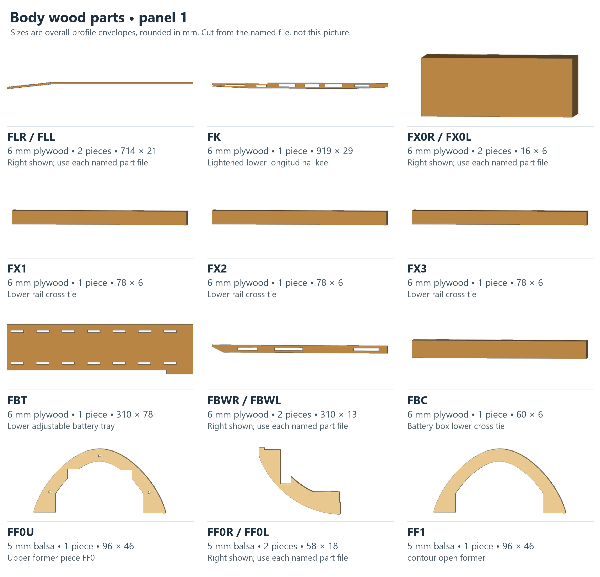

Each listed ID is one piece. Paired groups may show one representative; use each named file and pick every ID listed. Images are not cutting templates.

Match IDs to Data/Guide_Parts_Checklist.csv. Wood pictures marked as blanks still need the finishing operation. N1 is reused, not part of the 14 new prints.

## Body wood parts / panel 2

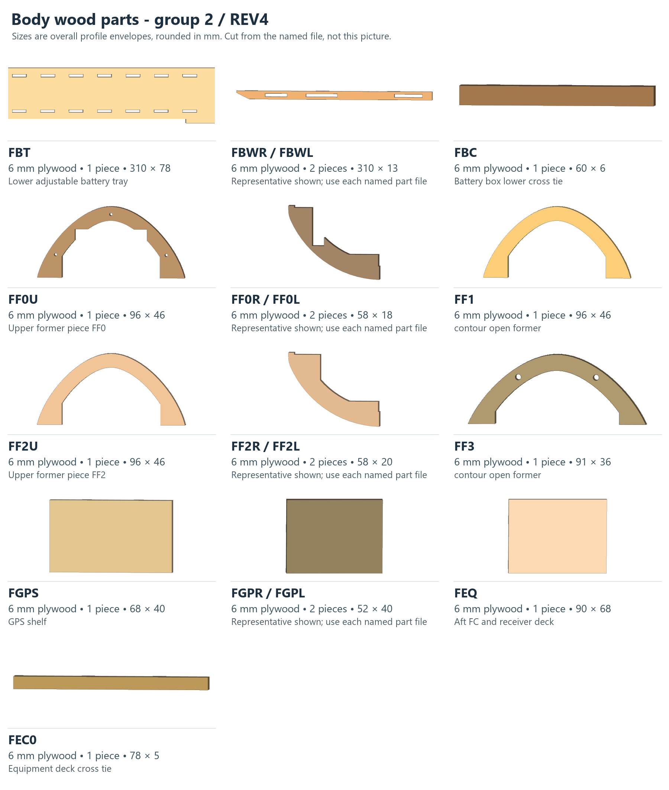

Each listed ID is one piece. Paired groups may show one representative; use each named file and pick every ID listed. Images are not cutting templates.

Match IDs to Data/Guide_Parts_Checklist.csv. Wood pictures marked as blanks still need the finishing operation. N1 is reused, not part of the 14 new prints.

## Body wood parts / panel 3

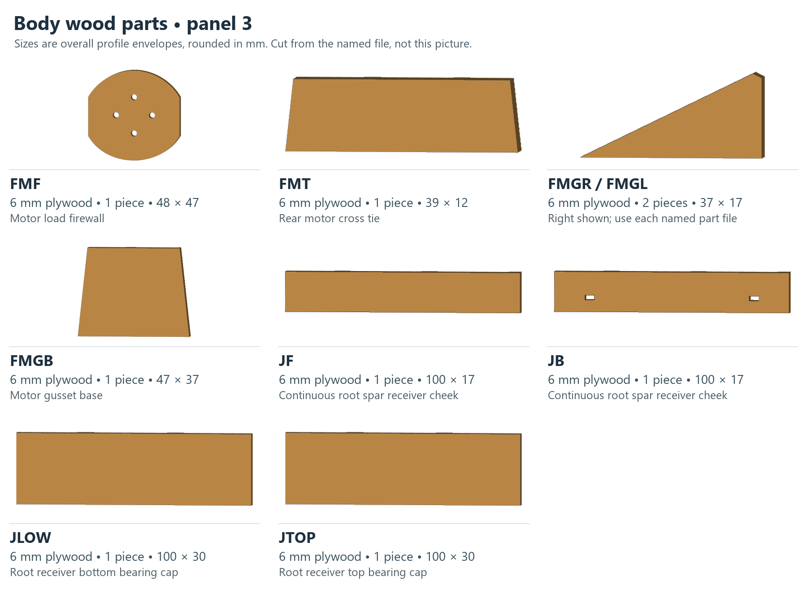

Each listed ID is one piece. Paired groups may show one representative; use each named file and pick every ID listed. Images are not cutting templates.

Match IDs to Data/Guide_Parts_Checklist.csv. Wood pictures marked as blanks still need the finishing operation. N1 is reused, not part of the 14 new prints.

## Match the 35 foam patterns

| Assembled skin | Flat patterns to pick | Count |
| --- | --- | --- |
| FNG1-4 - FNG1-4 | FNG1, FNG2, FNG3, FNG4 | 4 |
| FSL0 - Forward lower body | F09, F10, F13, F14, F15 | 5 |
| FSL1 - Middle lower body | F11, F12, F16, F17, F18 | 5 |
| FSL2 - Rear lower body | F19, F20, F21, F22, F33 | 5 |
| FSU2 - Removable rear upper cover | F23, F24 | 2 |
| FSU1 - Removable front upper cover | F25, F26 | 2 |
| FSL3 - Four-strip lower body shell | F27, F28, F29, F30 | 4 |
| WLIN - Left inner wing | F01 | 1 |
| WRIN - Right inner wing | F02 | 1 |
| WROUT - Right outer wing | F03 | 1 |
| WLOUT - Left outer wing | F04 | 1 |
| TRF - Right fixed tail | F05, F07 | 2 |
| TLF - Left fixed tail | F06, F08 | 2 |

The foam sheet previews in Cutting/ show the exact flat shapes and labels. Several flat pieces form one curved skin: 35 patterns do not mean 35 assembled shells. The extra FNT nose tip is a hand-shaped offcut.

**Preserve the outside** Mark contact pockets on the INSIDE while dry-fitting. Remove only the inner paper and needed foam. Bevel mating seams gradually. Keep the outer paper and the finished outside contour intact.

## Foam shapes / 1 of 2

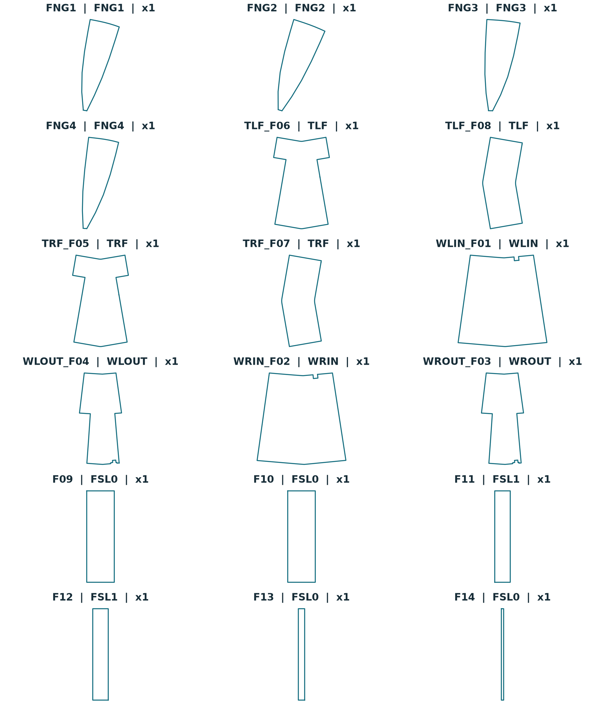

Exact flat DXF outlines, each labelled with pattern / assembled skin / quantity. Solid line = cut; orange dashed line = score. Shapes are independently scaled to fit these boxes.

Use the actual DXFs or full-size paper templates for cutting. These pictures are for finding and counting parts, not tracing. Match each piece to the preceding foam map.

## Foam shapes / 2 of 2

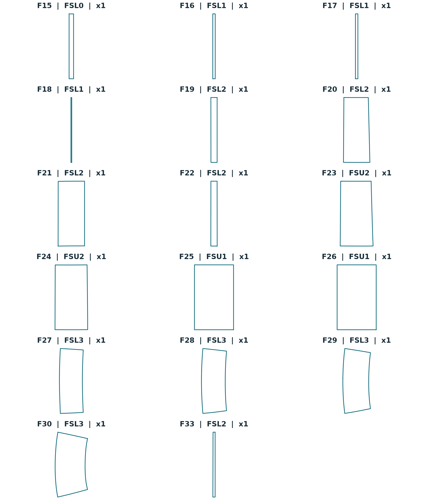

Exact flat DXF outlines, each labelled with pattern / assembled skin / quantity. Solid line = cut; orange dashed line = score. Shapes are independently scaled to fit these boxes.

Use the actual DXFs or full-size paper templates for cutting. These pictures are for finding and counting parts, not tracing. Match each piece to the preceding foam map.

## Print the right parts the right way

| Pick from Print/ | Qty | How to use |
| --- | --- | --- |
| FCF, FTF | 2 | Removable centre and rear fairings. |
| AR, AL | 2 | Moving ailerons; cut/file horn slots after printing. |
| TRC, TLC | 2 | Moving V-tail controls. |
| AHR, AHL | 2 | Fixed aileron hinge rails. |
| HAR, HAL, HTR, HTL | 4 | Four control horns. |
| MAR, MAL | 2 | Wing servo plates. |

1.  Load all 14 STLs in millimetres, 100%. Use each row of Print/Print_Schedule.csv; do not use one generic orientation for the whole batch.

2.  Allow about 274.1 mm usable print height plus startup clearance, and extra bed room for support/brim. Check the real machine before ordering.

3.  Print controls closed tip down, open root up. Keep internal supports out. TRC/TLC are tall and narrow: prove first-layer grip and stability with the specified 8 mm brim.

4.  Print FCF/FTF front end down: 0.2 mm layers, 2 walls, 15% gyroid, 8 mm brim. FCF: supports everywhere, bridge support on. FTF: buildplate-only supports.

5.  First test a 15 mm anchored bridge, support removal and representative fits using the actual PLA+/printer. Inspect the sliced walls and horn blocks.

**After printing** Remove support/brim. Check the real horn and hinge fit before a full batch. AR/AL are deliberate unslotted blanks: use Print/Finishing_Templates for their 3.2 x 17 mm horn slots. Fit balsa control plugs after fitting horns.

## Mark the body before assembly

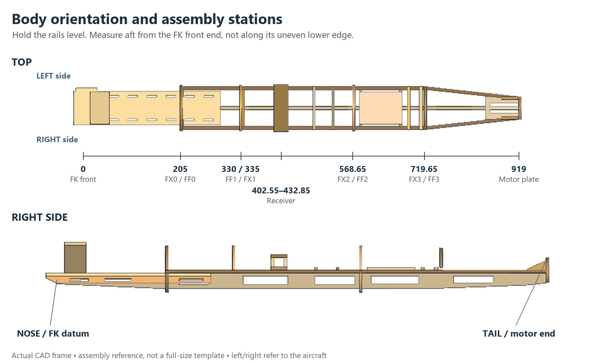

Measure stations aft from the FRONT TIP of FK. Keep rails level on supports; the uneven FK bottom is not a level datum.

| Front face / reference | Station from FK tip |
| --- | --- |
| FK front tip / battery shelf front | 0 / -20 mm |
| FX0L/R and FF0 front / FF1 front | 205 / 330 mm |
| FX1 front / receiver JF front / JB front | 335 / 402.55 / 426.85 mm |
| FX2 and FF2 front / FX3 and FF3 front | 568.65 / 719.65 mm |
| TROOT front / motor plate FMF front | 779 / 919 mm |
| Provisional balance line / pack centre | 409.16 / about 153.3 mm |
| Pack centre for removal | 130 mm; slide toward this mark, then lift |

These are longitudinal marks, not glue-face heights. Use the side view and positioned CAD for height and orientation. CAD coordinates: X across wings, Y aft, Z up. Station = CAD Y + 335 mm.

## 1. Build the straight body base

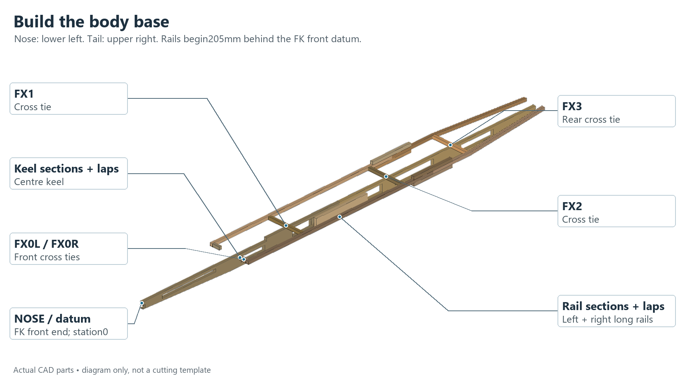

Nose: lower left. Tail: upper right. Rails begin205mm behind the FK front datum.

Pick: FK + FLR + FLL + FX0L + FX0R + FX1 + FX2 + FX3 (8 IDs, one each)

1.  Draw a straight centreline on a flat board. Cover the board with release film so glue cannot stick to it.

2.  Support both side rails at equal height with their top faces level. Hold FK, the centre strip, upright at the shown height; its uneven lower edge is not a leveling surface.

3.  Dry-fit the cross strips and the two side rails at the marked stations. Keep the rails flat and the centre strip upright.

4.  Check the top and side views before gluing the touching wood faces. Hold the frame straight until the glue cures.

**Check before moving on** The frame sits square on the jig. Left and right match. No part needs force to reach its shown position.

Do not guess positions from a perspective picture. Use the station plan and the positioned assembly STEP.

## 2. Add the body ribs and battery shelf

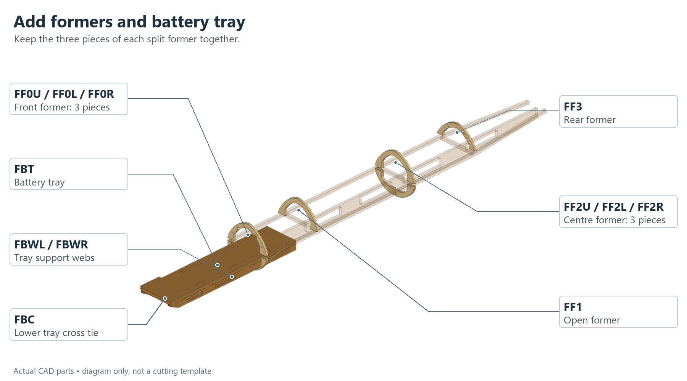

Keep the three pieces of each split former together.

Pick: FF0L + FF0R + FF0U + FF1 + FF2L + FF2R + FF2U + FF3 + FBT + FBWL + FBWR + FBC (12 IDs, one each)

1.  Fit the eight body-rib pieces at their numbered stations. FF0 and FF2 each have separate left, right and upper pieces.

2.  Fit FBWL and FBWR, the battery-shelf side supports, into the matching rib notches. Add FBC and shelf FBT.

3.  Keep the battery opening clear. Do not join the split rib pieces across this opening.

4.  Round the strap-slot edges. Dry-fit a 2 mm nonslip pad, the battery and both owned Velcro straps before gluing.

**Check before moving on** The real battery slides without catching. Two straps fit through slot rows about 80 mm apart within the battery length.

Battery travel is an adjustment range, not permission to leave the battery loose. Tighten both straps for every test.

## 3. Add the equipment shelves

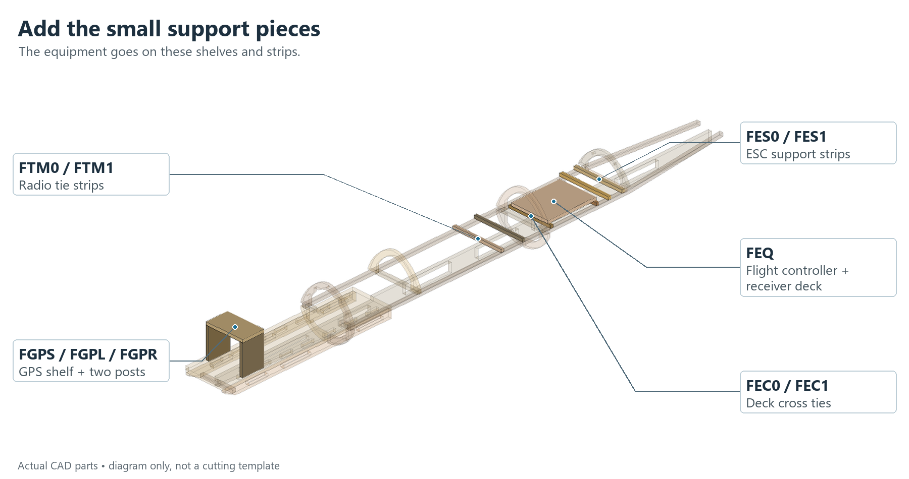

The equipment goes on these shelves and strips.

Pick: FGPS + FGPL + FGPR + FEQ + FEC0 + FEC1 + FES0 + FES1 + FTM0 + FTM1 (10 IDs, one each)

1.  Fit GPS shelf FGPS on its two posts FGPL/FGPR in the nose bay.

2.  Fit FEC0/FEC1 across the aft body, then add FEQ, the flight-controller and receiver shelf.

3.  Fit FES0/FES1 as the two ESC support strips. Fit FTM0/FTM1 for the telemetry radio.

4.  Set the real equipment on its supports with temporary pads/ties. Check plug access before any covers go on.

**Check before moving on** USB, memory card, receiver plugs and ESC leads remain reachable. Nothing hangs into a control linkage.

Install electronics later. This step checks the empty shelves and the real equipment fit.

## 4. Fit the wing socket and motor support

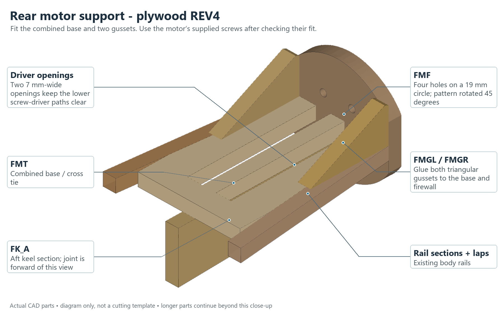

These are the existing wood parts; use the motor’s supplied hardware.

Pick: JF + JB + JLOW + JTOP + FMF + FMT + FMGL + FMGR + FMGB (9 IDs, one each)

1.  Dry-fit lower plate JLOW and side walls JF/JB. Try a measured three-layer tongue sample BEFORE bonding upper plate JTOP.

2.  Adjust the sliding fit, then close the socket. Keep the sample/tongue and sliding space free of glue. Nominal tongue width is 18 mm; socket gap is 18.3 mm.

3.  Fit rear cross strip FMT, base FMGB and triangular braces FMGL/FMGR. Add upright motor plate FMF.

4.  Dry-fit the motor using its supplied screws. The four holes are on a 19 mm circle. Remove the motor again while gluing.

**Check before moving on** Socket and motor plate meet their supports without gaps. The motor screws engage correctly and cannot touch the windings.

A firewall is the motor mounting plate. Keep the propeller OFF during assembly and electrical setup.

## Detail: wing socket

Close the wing socket last

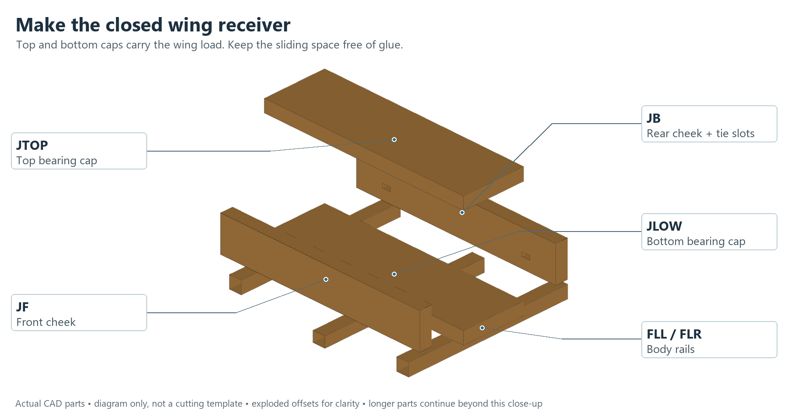

Test an 18 mm three-layer tongue in the 18.3 mm nominal socket before bonding JTOP. Wood thickness and glue change the real fit. Keep the sliding space clean.

## 5. Make both wing beams

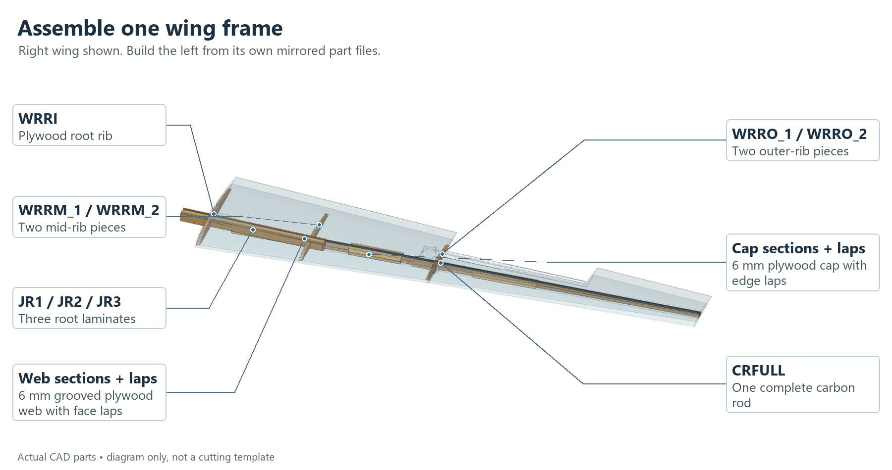

Right wing shown. Build the left from its own mirrored part files.

Pick: LCR + LCL + WBR + WBL + JR1 + JR2 + JR3 + JL1 + JL2 + JL3 (10 IDs, one each)

Two complete 5 x 1000 mm solid carbon rods: CRFULL and CLFULL.

1.  Sort the right beam parts and their matching left parts. Keep balsa grain along the wing. Keep root-tongue plywood face grain along the wing too.

2.  Use the flat wood blanks first. Shape the round rod seats shown in the finished STEP; a laser cannot cut these curved grooves.

3.  Fit the lower strip, upright web and whole rod in a straight jig. Bond web-to-strip and rod-to-web continuously. Bond the final roughly 100 mm of rod into the lower-strip groove.

4.  Shape the rod channel in each root layer. Glue JR1/JR2/JR3 into one right tongue and JL1/JL2/JL3 into one left tongue. Bond each tongue to its beam and carbon overlap.

**Check before moving on** All rod/web/lower-strip joints touch continuously. Both beams match. Each tongue slides into the body socket without forcing.

A spar is the wing beam. The web is its upright balsa strip. Do not shorten the carbon rods or butt them together at the centre.

## Detail: removable wing roots

Make the three-layer wing tongue

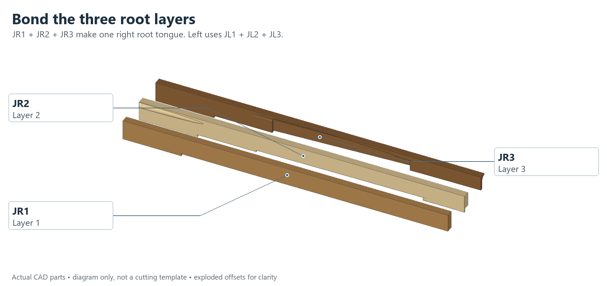

Use each cut blank in its own orientation. Shape the carbon seat before lamination. Bond all three layers into one tongue; do not leave dry gaps.

Seat and retain both wings

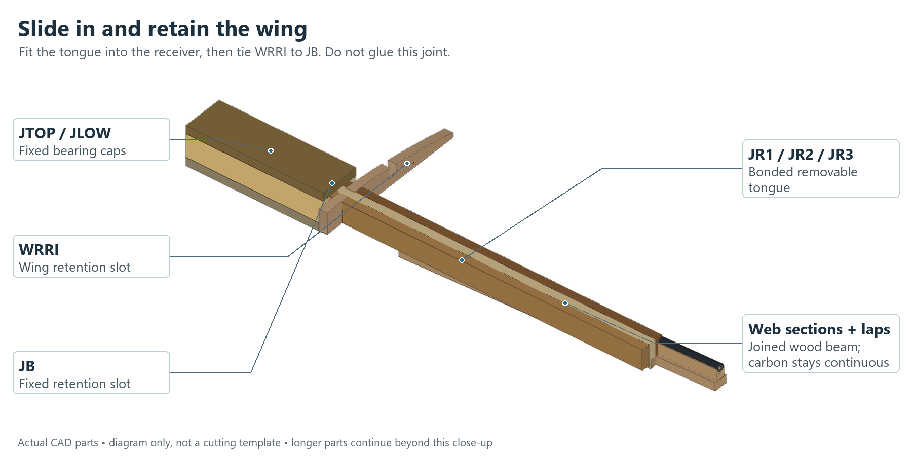

The root-rib slot and JB slot take a 3 mm retention tie. Release the tie and servo connector before sliding the complete wing out.

Rib front faces, measured out from the physical wing root: 0 mm (root), 194.35 mm (middle), 435.01 mm (outer). Mirror the left wing. Each half has one plywood root rib and two-piece balsa middle/outer ribs.

## 6. Fit wing ribs and check removal

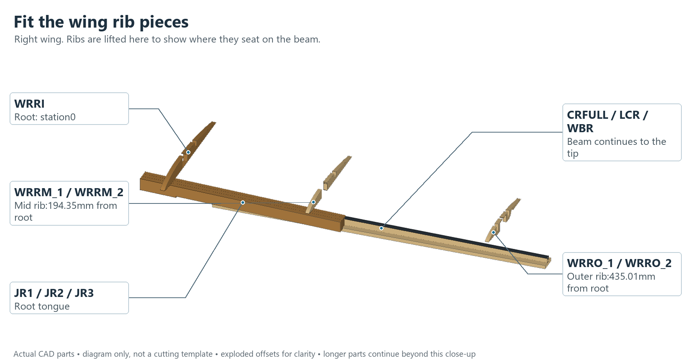

Right wing. Ribs are lifted here to show where they seat on the beam.

Pick: WRRI + WLRI + WRRM_1 + WRRM_2 + WLRM_1 + WLRM_2 + WRRO_1 + WRRO_2 + WLRO_1 + WLRO_2 (10 IDs, one each)

1.  Fit one root rib, two middle pieces and two outer pieces per wing. The outer ribs sit about halfway along the half-wing, not at its tip. Do not bridge a beam opening.

2.  Set each rib square at the station shown. Hold the wing profile with the jig while the glue cures.

3.  Insert both wings into the body socket. Check equal angles and equal height before adding skins.

4.  Try a 3 mm tie through each root-rib slot and the matching JB slot. To remove a wing later: lift the centre cover, unplug its servo, cut the tie and slide the whole wing out.

**Check before moving on** Both wings seat fully, stay positively retained and withdraw smoothly after releasing the ties.

Ribs are the crosswise wing-profile pieces. Their small perimeter clearance must become a continuous glue joint, not a dry gap.

## 7. Form and fit the wing skins

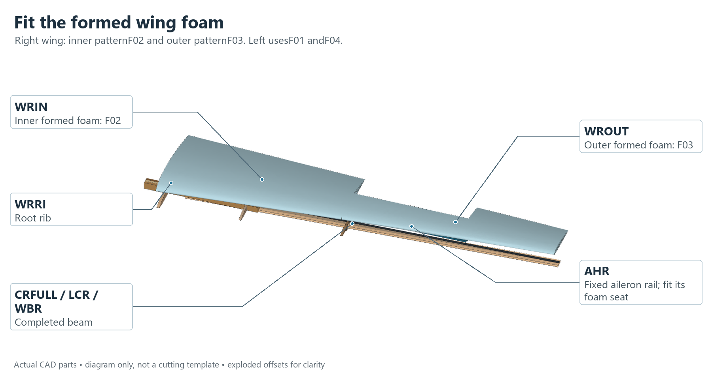

Right wing: inner patternF02 and outer patternF03. Left usesF01 andF04.

Pick: Foam: WLIN, WRIN, WLOUT, WROUT

Four flat wing patterns: F01 left inner, F02 right inner, F04 left outer, F03 right outer.

1.  First make a short trial section from the real board with the real beam and deepest groove. Prove that the outside paper survives shaping.

2.  Dry-fit MAR/MAL, the real wing servos, centred factory arms and leads before wrapping skins. Mark service openings and disconnect routes.

3.  Wrap each correctly labelled pattern around the dry wing skeleton. Mark beam, rib, root and servo contacts on the INSIDE.

4.  Open the skin again. Remove inner paper only at marked pockets. Pare the foam gradually and refit; keep the outside paper intact.

5.  Bond MAR/MAL to their fitted seats and the fixed aileron rails into the marked rear-edge seats. Glue the skin to its supports while the outside profile stays in the jig.

**Check before moving on** No beam or servo pushes the skin outward. The lower-cap pocket can leave only about 0.5 mm of outer foam/paper, so inspect the trial section first.

The flat foam pattern gives the outside shape. It does not cut the inner pockets for you. Keep servo arms and root ties accessible.

## 8. Build the fixed V-tail

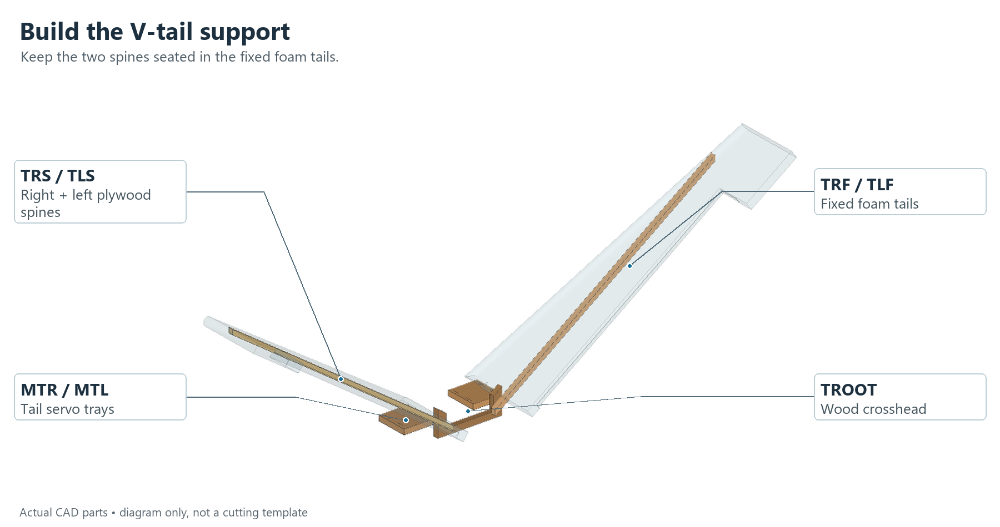

Keep the two spines seated in the fixed foam tails.

Pick: TROOT + TRS + TLS + MTR + MTL (5 IDs, one each). Foam: TRF, TLF

Right foam patterns F05 + F07. Left foam patterns F06 + F08.

1.  Fit TROOT, the crosspiece that carries the tail, to the body rails. Fit right/left balsa spines TRS/TLS at 35 degrees above horizontal on each side.

2.  Fit servo trays MTR/MTL. Lightly dress only any local high spot so the real servo rests flat; the modeled bedding allowance is at most 0.03 mm.

3.  Transfer spine, tray, servo and TROOT contacts onto the inside of the tail foam. Shape these pockets, then dry-fit printed controls and horns before bonding the foam.

4.  Bevel the fixed trailing-edge underside. Start 3 mm below the hinge line, measured perpendicular to the canted panel, and pare 20 degrees from the square edge. Keep the upper tape landing.

5.  Prove the full mixed control travel with temporary hinges, then glue the fixed foam in its jig.

**Check before moving on** Tail halves match at 35 degrees. The printed moving tail and horn can swing through the full combined +/-20-degree range without rubbing.

Only bevel the fixed FOAM. Do not reshape the printed control. Use Data/tail_travel_relief.json and the finished STEP for the exact span and limits.

## Detail: tail hinge clearance

Make room for tail movement

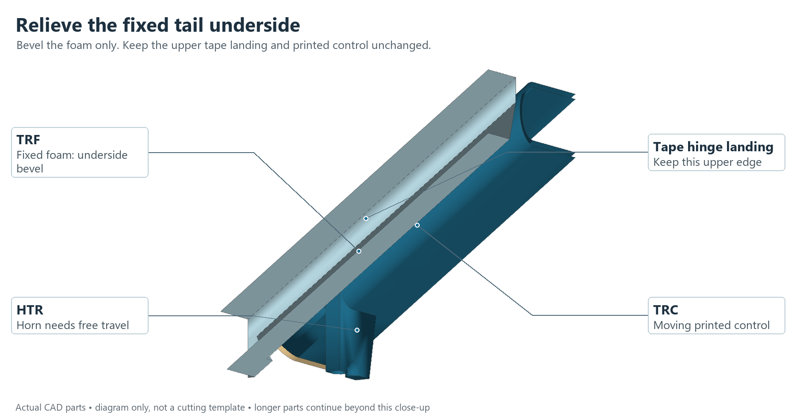

Bevel the fixed foam underside only. Preserve the upper tape landing. Test the horn as well as the control surface through the full combined travel.

## 9. Fit hinges, horns, servos and spokes

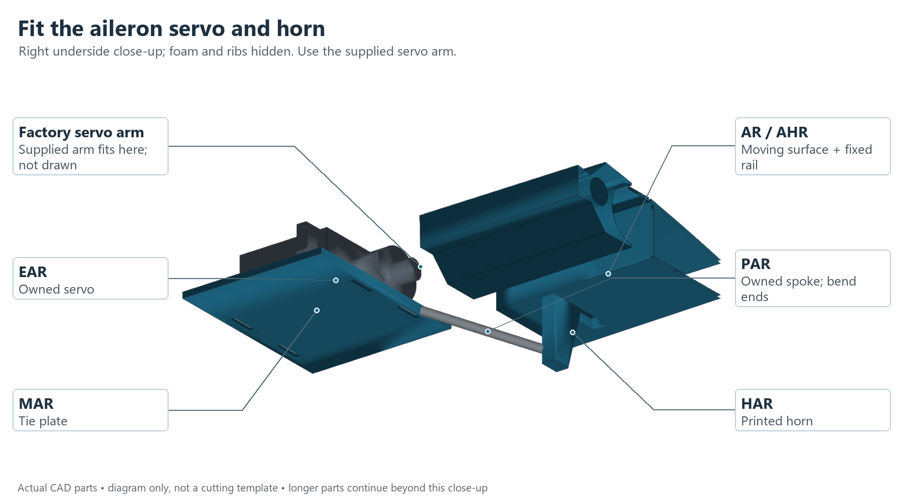

Right underside close-up; foam and ribs hidden. Use the supplied servo arm.

Pick: AR + AL + TRC + TLC + AHR + AHL + HAR + HAL + HTR + HTL + MAR + MAL + ARP + ALP + TRCP + TLCP (16 IDs, one each)

Four MG90S servos, four factory arms and four bicycle spokes. Keep the fifth servo as a spare.

1.  Print AR/AL as supplied blanks. Use Print/Finishing_Templates to cut/file their 3.2 x 17 mm horn slots. Dry-fit, then bond all four keyed horns into their matching bosses.

2.  Sand ARP/ALP/TRCP/TLCP blanks to the finished section. Keep upper-edge hinge gaps: 0.7 mm ailerons, 1.5 mm tails. Fit continuous tape on both faces; add plugs after horns cure and pass a pull-check.

3.  Centre servos electrically; fit factory arms with their supplied centre screws. Tie servos to their supports. Measure each spoke between the actual arm/horn holes before bending.

4.  Fit captive spoke ends. The tail spoke end needs 3 mm usable axial movement through the servo-arm hole while retained. Never loosen the arm on its shaft. Check every combined stick corner.

**Check before moving on** Start at no more than +/-15 degrees on ailerons and +/-20 degrees TOTAL on each mixed tail. No rubbing, rod escape, tape peeling or servo buzzing.

AHR/AHL and MAR/MAL were dry-fitted earlier. The modeled servo-arm hole is 10 mm from the shaft; ailerons need about -36.5/+48 degrees of servo rotation. Set endpoints from real surface travel, not a default +/-45-degree servo setting.

## Detail: tail linkage

Fit the tail surfaces as a pair

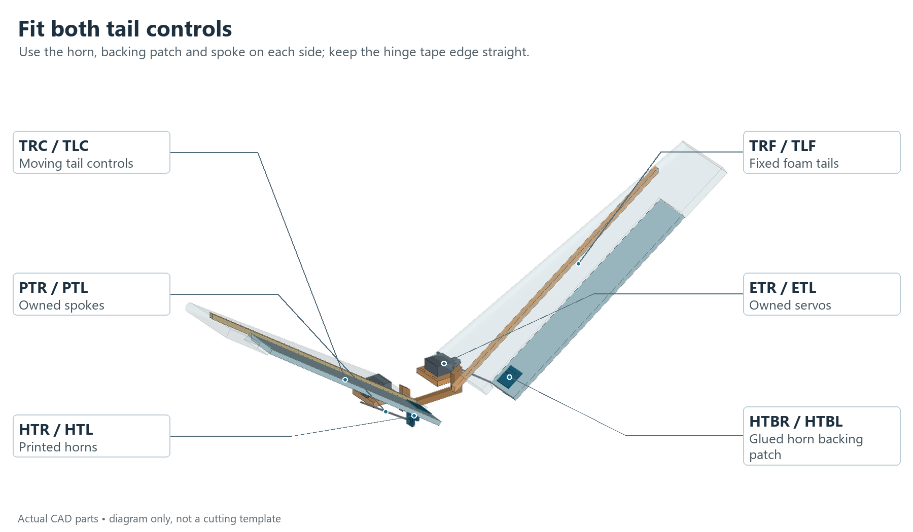

The flight controller mixes elevator and rudder commands. Start with neutral arms and check both mixed axes before setting endpoints.

Keep the spoke ends captive

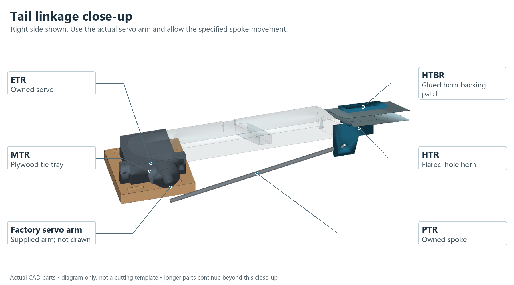

Use the four owned spokes and factory servo arms. Do not assume the spoke thread is M2. Measure and bend to the actual centred linkage.

Nominal pin-centre references: aileron spokes about 29.3 mm; tail spokes about 88.4 mm, before bend allowances. The captive tail spoke end needs 3 mm usable sliding movement through the arm hole. Keep the arm firmly screwed to its shaft. Prove full travel with the actual linkage.

## 10. Close the body and prove access

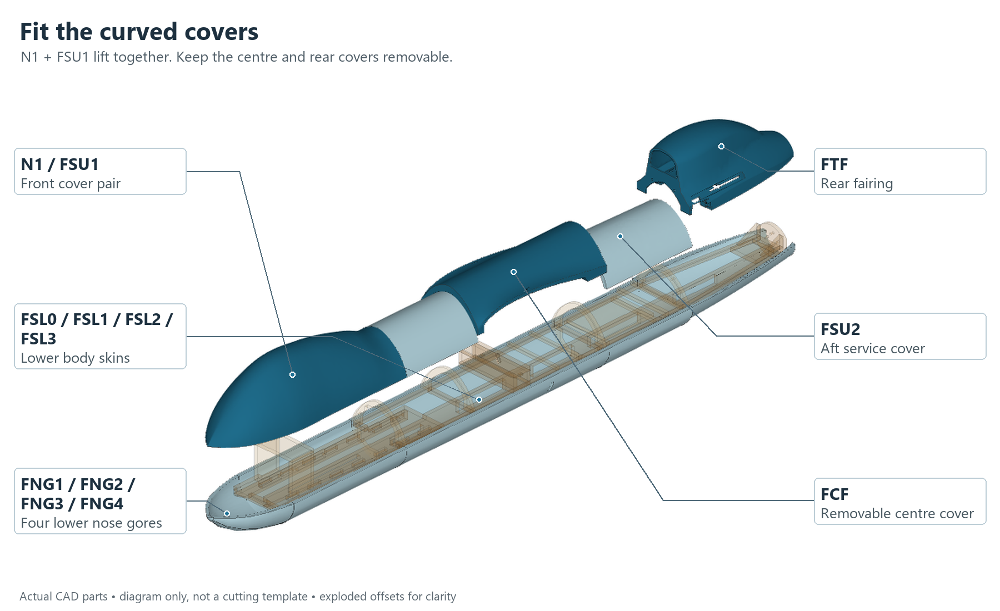

N1 + FSU1 lift together. Keep the centre and rear covers removable.

Pick: Foam: FSL0, FSL1, FSL2, FSL3, FSU1, FSU2, FNG1, FNG2, FNG3, FNG4

Existing nose N1; printed covers FCF/FTF; one hand-shaped FNT nose-tip offcut, 13 x 7 mm.

1.  Dry-fit GLEG_L/R/N to the frame first. Mark and cut their exits in the lower foam before bonding the skins.

2.  Match the flat body patterns to the skin map. Form lower skins and four nose strips around the frame. Bevel seams and preserve their outside paper.

3.  Round the small FNT offcut to close the last nose gap. Dry-fit your existing N1 before bonding the lower nose.

4.  Fit the removable covers with tape. Transfer two small aft-edge notches into FSU2 around the tail trays, about 7 mm wide and 2 mm deep each.

5.  Check cover removal before closing. N1 and FSU1 lift off TOGETHER after releasing both tapes and the pitot/tubes. FCF may need up to 0.2 mm local inner-wing foam edge fitting.

**Check before moving on** Battery, wings, plugs and servos remain accessible. Unplug the battery, release straps and slide the pack centre to the removal mark, 130 mm behind the FK front tip, then lift it out.

Dress only the marked foam mating edges. Keep structural wood intact. Do not permanently glue service covers shut.

## 11. Add the simple wheels and propulsion

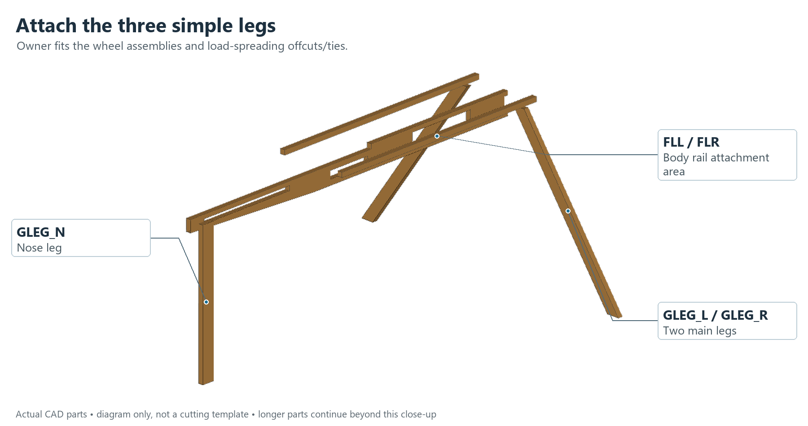

Owner fits the wheel assemblies and load-spreading offcuts/ties.

Pick: GLEG_L + GLEG_R + GLEG_N (3 IDs, one each)

Three owned wheel/axle assemblies, small plywood offcuts, ties, actual motor/prop hardware.

1.  Fit each plain leg between the body frame and its owned wheel assembly. Spread the body-end load along wood with a small flat offcut and ties.

2.  Measure the complete wheel offsets BEFORE trimming legs. Shortening a leg lowers clearance. Set wheels straight and the body level; lock any swivel.

3.  Install the motor without its prop. Finish the prop-off electrical checks. Then disconnect the battery and temporarily fit the actual prop for clearance checks.

4.  With the loaded plane held 10 degrees nose-up, turn the prop by hand through a full circle. Require at least 20 mm ground clearance, including flex; adjust before final leg attachment.

**Check before moving on** The plane rolls straight. Wheels turn freely. Attachments cannot punch into unsupported foam. Propeller and tail clear the ground.

There is no designed bungee hook or catapult fitting. The basic plan is a tested smooth-runway takeoff; see the launch page.

## Place the electronics

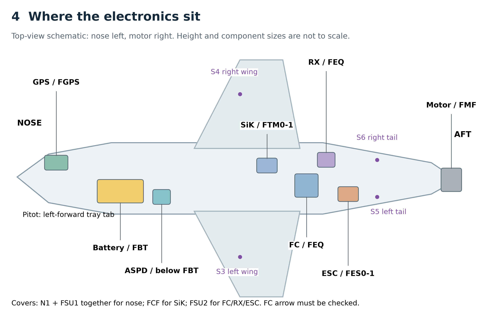

Placement map, not a PCB pin layout. Nose to the left; motor at the rear.

| Item | Support / access |
| --- | --- |
| GenX 4S 5200 mAh | FBT shelf, nonslip pad, two straps. Lift N1 + FSU1 together. |
| M9N-5883 GPS / compass | FGPS shelf above forward battery; antenna face up. |
| ASPD-4525 / pitot | Board under tray rear; pitot on left-forward FBT tab. Label both hoses. |
| SiK 433 air radio | FTM0/FTM1 under FCF; antenna clear of carbon and power wiring. |
| Matek F405-WING V2 / FS-iA10B | FEQ deck: FC forward, receiver behind it. Remove FSU2. |
| ReadytoSky 40 A / Emax ECO II 2807 1300KV | ESC across FES0/FES1 with airflow; motor behind FMF. |
| Four MG90S servos | MAR/MAL wing plates; MTR/MTL tail trays. Keep arms and root plugs accessible. |

Use simple pads and ties. Protect solder joints and restrain leads. FC long side runs across the body: read its actual arrow/top face before setting orientation. Keep USB, SD card and plugs reachable. Test cooling with covers fitted.

## Wire power and the four servos

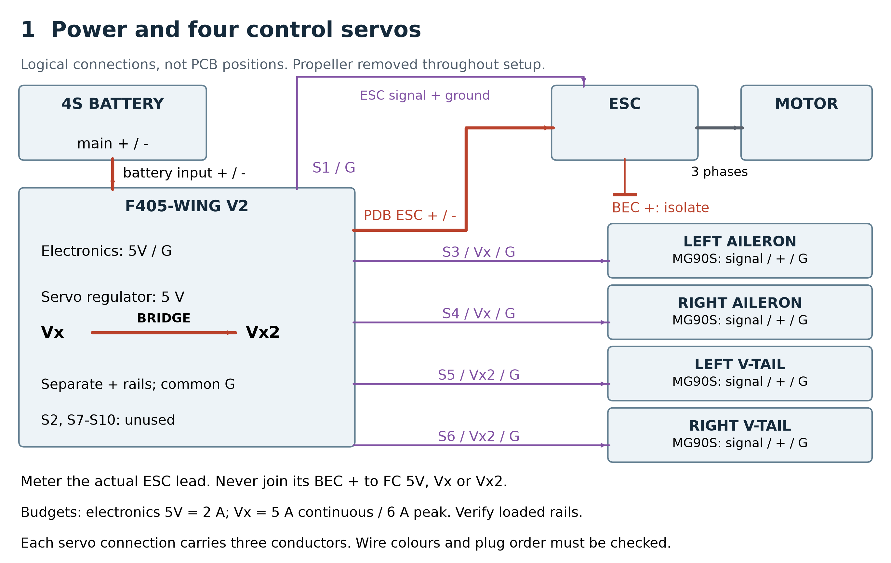

Follow actual board labels and polarity. A line marked + / - carries two conductors; each servo lead has signal, supply and ground.

1.  Battery main leads go to the FC battery INPUT pads; ESC supply goes to the FC ESC OUTPUT pads. This keeps current flowing through the board current sensor.

2.  S1 and ground go to the ESC signal input. Any ESC BEC positive stays disconnected and individually insulated. Motor phases go to the motor; swap any two only with power disconnected if direction is wrong.

3.  Leave S2 and S7-S10 unused. Leave 9 V, 12 V and video pads empty. The battery balance plug is not an FC supply.

4.  Keep power leads together and clear of sensors. Measure the battery-to-PDB lead length; follow the actual ESC maker's input-lead/capacitor guidance.

PDB = board power distribution pads. Vx = regulated servo supply; Vx2 is its second output bank. Set 5 V and bridge the labelled Vx/Vx2 pads with power removed. Insulate any ESC BEC positive; do not parallel it with the FC supply.

## Connect GPS, compass and airspeed

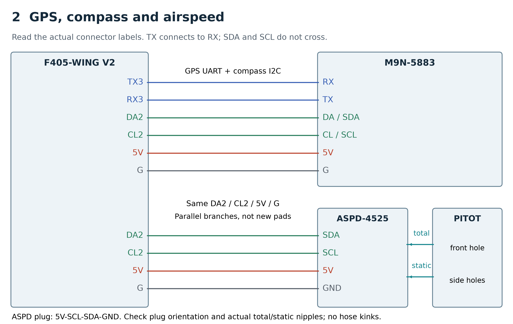

TX = transmit; RX = receive. SDA/DA and SCL/CL are the two I2C sensor-bus wires. The two pitot lines are hoses, not electrical wires.

1.  GPS TX goes to RX3; GPS RX to TX3. Compass DA/SDA goes to DA2; CL/SCL to CL2. Both GPS and compass connections are needed.

2.  The ASPD board shares DA2/CL2 with the compass. Its pin order is 5V-SCL-SDA-GND; verify which way the real connector faces.

3.  Label both hoses. Connect pitot total pressure to the sensor total-pressure port and static pressure to static. Check the actual kit diagram; do not rely only on a nipple being above or below.

4.  Keep hose bends open and all pitot openings exposed. Leave enough tube for the removable nose. Keep the GPS away from high-current wire loops.

**Use regulated power** GPS, compass and ASPD use the labelled 5 V and ground supply, never raw 4S battery voltage. Follow pin labels, not connector colours.

## Connect the receiver and telemetry

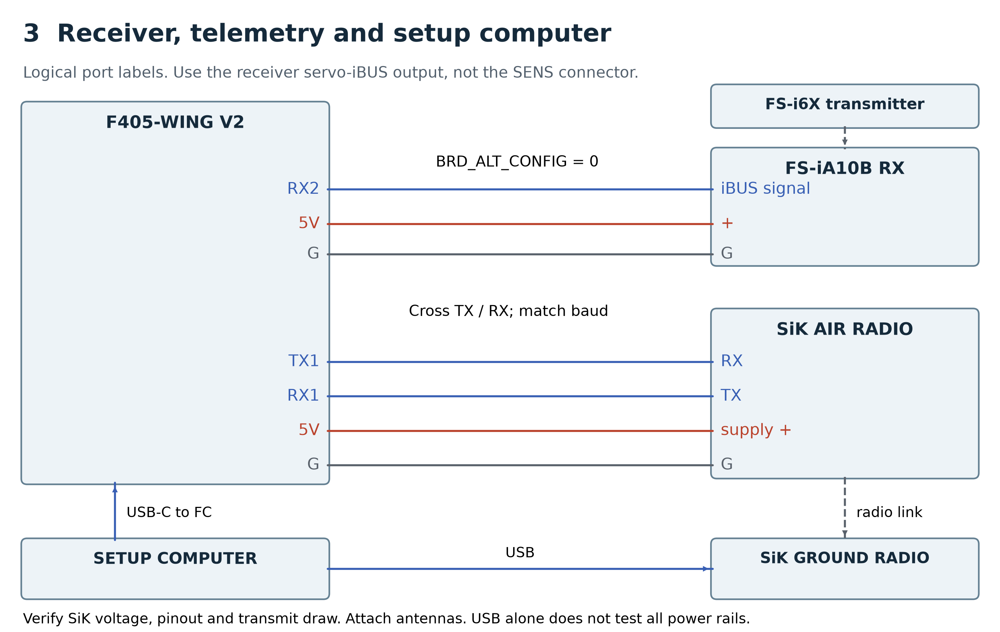

FS-i6X and the SiK ground radio stay on the ground. USB is for setup; telemetry must also work without the FC USB cable.

1.  Use the receiver SERVO iBUS output, not SENS. Its signal goes to RX2; supply comes from FC 5 V and ground. Keep BRD_ALT_CONFIG=0 for this route.

2.  Cross TX1 to air-radio RX and RX1 to air-radio TX. Verify the actual SiK voltage, connector pinout and transmit current before connecting its 5 V supply.

3.  Attach radio antennas. Keep receiver antenna tips clear of carbon and power wiring. Label wing servo disconnects; leave a service loop without loose wires near linkages.

4.  Use common grounds. Check the 2 A electronics budget and 5 A continuous / 6 A peak servo budget under real load; a USB-only test is not enough.

**Before the first power-up** Remove the propeller. Check every + and ground with a meter. Check connector orientation on the real receiver, GPS, sensor and radio. USB power alone cannot prove the battery-powered rails.

## Set up and test 1-3

Use Mission Planner on Windows. Connect the FC with a USB data cable, choose its COM port and Connect. SETUP may be called INITIAL SETUP; CONFIG may be CONFIG/TUNING.

1. Inspect and power

Prop off. Check labels, soldering, polarity and no +/G short. Meter disconnected ESC lead; insulate any BEC positive. Set Vx=5 V and bridge Vx2.

PASS: Correct polarity and about 5 V at every low-voltage plug on battery power; no unexpected heating.

IF NOT: Disconnect; correct pins/short/jumper. Never parallel ESC BEC with FC 5V or Vx.

2. Firmware and orientation

In Mission Planner, load supported stable ArduPlane MatekF405-Wing (V2 needs 4.4+); record version. Read fitted FC arrow/top face; set AHRS_ORIENTATION in Full Parameter List.

PASS: Displayed attitude follows nose-up/right-roll correctly; USB/SD remain accessible.

IF NOT: Fix target or board rotation first; do not compensate with servo reversal.

3. Accelerometer

Mission Planner Accel Calibration: disarmed, complete all six positions, holding still at each prompt. Then use Calibrate Level in intended level flying attitude.

PASS: Calibration accepted; level aircraft displays level.

IF NOT: Repeat on firm support; check orientation. Level-only is not full calibration.

| Mission Planner task | Menu |
| --- | --- |
| Firmware | Disconnect the software link; SETUP > Install Firmware. |
| Board rotation / named settings | CONFIG > Full Parameter List. Search, edit, Write Params; reboot when required. |
| Six-position / level calibration | SETUP > Mandatory Hardware > Accel Calibration. |

A new FC without an ArduPilot bootloader needs the official first-install procedure before normal firmware updates. Use the Matek/ArduPilot links in Data/Guide_Sources.md.

## Set up and test 4-6

4. Compass

Mission Planner Compass: calibrate outdoors away from metal/tools, with GPS/compass fixed in final orientation. Reboot if requested.

PASS: Accepted calibration; smooth heading changes matching known directions.

IF NOT: Move magnetic wiring/material; correct orientation and recalibrate.

5. Radio

Plain FS-i6X airplane model; transmitter V-tail mix off. Bind iA10B and select servo iBUS/RX2. In Radio Calibration, move all sticks/switches. Assign MANUAL and FBWA in Flight Modes.

PASS: Inputs match sticks, reach endpoints and centre reliably; modes switch correctly.

IF NOT: Fix input map/reversal or iBUS port, before changing surface outputs.

6. Output map and neutral

Set SERVO1_FUNCTION=70 (ESC); SERVO3_FUNCTION=4 (left aileron); SERVO4_FUNCTION=4 (right aileron); SERVO5_FUNCTION=79 (left V-tail); SERVO6_FUNCTION=80 (right V-tail). Set SERVO2_FUNCTION and SERVO7_FUNCTION through SERVO10_FUNCTION to 0. Use compatible PWM. Secure centred arms; adjust pushrods before trim.

PASS: Four surfaces neutral; no steering output; motor stopped at minimum/disarmed.

IF NOT: Correct output map/linkage/trim. Shared timer pairs must use compatible protocols.

Menus: SETUP > Mandatory Hardware > Compass, Radio Calibration or Servo Output. Flight Modes may be under Mandatory Hardware or CONFIG. Use Full Parameter List for exact SERVOx_* values.

**What the modes mean** MANUAL: your sticks drive the surfaces through the configured mixing. FBWA: the controller stabilizes roll and pitch; you still control throttle. FBWA is not automatic navigation.

## Set up and test 7-9

7. Direction and travel

MANUAL: right roll gives right aileron up/left down; pitch-up gives both tail trailing edges up. Right yaw, viewed from behind: left tail trailing edge up/right; right tail down/right. FBWA: tilt right gives left aileron up/right down; nose-up tilt gives both tails down. Test mixed corners.

PASS: Correct responses; no buzz/binding/horn movement. Initial ceilings: ailerons +/-15 degrees, total mixed V-tail +/-20 degrees, subject to real linkage.

IF NOT: Wrong direction: output reversal. V-tail one mixed axis wrong: exchange 79/80; both wrong: reverse output. Reduce MIN/MAX if binding.

8. ESC and motor

Identify ESC protocol/manual after RC/output setup. If its PWM manual specifies high/low teaching: prop off, FC on USB, battery disconnected; select MANUAL and arm as required, set throttle high, connect battery, wait specified calibration tone, then lower throttle immediately. Wait confirmation; disconnect and restart at low throttle. DShot/CAN needs no endpoint calibration.

PASS: Maker acknowledgement; normal reboot gives stopped idle and smooth start. Brief restrained test confirms pusher rotation.

IF NOT: Stop on unknown type/tones. Follow actual ESC manual, not Copter motor wizard. Power off before phase swapping.

9. GPS and telemetry

Obtain GPS fix outdoors. Connect ground SiK to computer; match baud/protocol. Check radio telemetry without FC USB.

PASS: Healthy fix, plausible position and continuously updating radio data.

IF NOT: Check TX/RX crossing, power, antennas, baud and protocol.

GPS: SERIAL3_PROTOCOL=5. SiK: SERIAL1_PROTOCOL=2 if both ends support MAVLink2; match their baud rate. Set named values in CONFIG > Full Parameter List. Never choose a baud rate without checking the actual radio.

## Set up and test 10-12

10. Airspeed

Set ARSPD_TYPE=1 and ARSPD_BUS=1. Loosely cover pitot against wind at startup; warm at least 1 minute, then use PREFLIGHT CALIBRATE > Do Action to zero. Uncover; apply gentle airflow/pressure.

PASS: Healthy sensor; near-zero still air, rise with airflow, return afterwards. Small 0-3 m/s noise can be normal.

IF NOT: Check supply, I2C, hoses/leaks/kinks; repeat zero without wind. Do not blow hard. This does not calibrate airspeed ratio.

11. Battery and rail load

Start BATT_MONITOR=4; BATT_VOLT_PIN=10; BATT_CURR_PIN=11; BATT_VOLT_MULT=11.0; BATT_AMP_PERVLT=66.7. Calibrate against meter/known safe load. Move four servos together under representative load.

PASS: Voltage/current agree with reference; no reset/dropout; loaded rails remain within device ratings.

IF NOT: Fix V2 scales/current-sensor path or resistive joints. Failed capacity needs isolated supply review, not parallel BEC.

12. Failsafes and save

Set throttle cut, THR_FAILSAFE=1 and selected RC-loss/low/critical-battery actions. Prop off: switch transmitter off, wait the configured loss timer, then restore it. For a bench battery-trigger check, temporarily set the trigger above measured pack voltage; record action, then restore normal thresholds and reboot. Do not deeply discharge the pack.

PASS: Ground station detects each loss/trigger, applies chosen action and recovers as planned. Throttle cut stops motor. Save parameters/results.

IF NOT: Correct receiver loss reporting or action/timer settings. Held-last throttle fails. Confirm short/long actions separately; ground tests do not prove the airborne RTL path.

Menus: SETUP > Optional Hardware > Battery Monitor / Airspeed; named BATT_* and ARSPD_* values are also in Full Parameter List. Failsafe controls may be under Mandatory Hardware; use the parameter list for exact actions/timers.

## Balance, load and service checks

Balance the whole model, not the empty shell

1.  Fit the actual flight battery, covers, prop, wheels and all wiring. Weigh the complete model and record the result.

2.  Mark the provisional balance line 409.16 mm aft of the FK front tip (CAD Y = 74.16). Support both sides at this line without damaging the wing.

3.  Move the battery to balance. The calculation starts near centre station 153.3 mm (CAD Y about -181.7). Tighten both straps and recheck. Do not add ballast before measuring.

4.  Check left-right balance and neutral surfaces. Have an experienced builder/pilot review the actual CG and stability before flight. The provisional 20%-of-MAC target is not flight-tested.

**Structural checks still matter** Proof-test the real wing roots, carbon bonds, tail, motor support and battery restraint with an experienced builder. Inspect for cracks, peeling, permanent set and movement. The idealised beam model predicts about 106 mm tip deflection at 3 g: it is not strength qualification.

Prove the three service jobs

| Job | Pass |
| --- | --- |
| Battery | Release N1/FSU1 tapes and pitot/tubes; lift covers together. Unplug the battery, release straps; slide pack centre to station 130 mm, then lift. |
| Wing | Lift centre cover; disconnect servo; cut retention tie; slide whole wing out. Refit and retie without damaged wires. |
| Airspeed board | Front covers and battery out; release board attachment, slide aft to CAD Y -25, then lift. Hoses remain reachable. |

MAC means mean aerodynamic chord: a reference wing chord used to describe CG. Here it is about 169.8 mm. Record measurements in Data/Physical_Checks.csv.

## Ground checks and the first launch

| Check off in order | Pass condition |
| --- | --- |
| 1  Airframe and controls | Joints inspected; actual load checks complete; four surfaces move correctly, remain retained and never bind at mixed corners. |
| 2  Propulsion suitability | Resolve the 9-inch prop / 2807 motor mismatch. Secure instrumented test: record loaded voltage, current, thrust, RPM and motor/ESC temperature. Stay within actual component limits. |
| 3  Prop installation | Correct pusher orientation and rotation; real adapter/shaft fit; supplied screws/nut secure. Check full-circle blade clearance with battery disconnected. |
| 4  Loaded gear clearance | At intended nose-up rotation, prop and tail clear the ground. Guide check: at least 20 mm prop clearance at 10 degrees nose-up, including flex. Real wheel offsets matter. |
| 5  Radio / rails / failsafe | Range check per transmitter manual; four loaded servos cause no reset; cut/loss/battery-trigger behaviour recorded. Save parameters. |
| 6  Slow roll | Smooth level clear area, fixed wheels aligned and swivel locked; low-speed tracking stays straight. Predetermine a stop plan. |
| 7  Pilot decision | Experienced RC pilot reviews mass, CG, structure, thrust, field, wind, control authority and abort plan before committing to launch. |

**Basic launch method** Use wheels on a suitable smooth runway only after the checks pass. No hand-launch grip, bungee attachment or catapult release was designed. Automatic takeoff cannot replace these tests. Required runway length and flight time remain measurements to establish.

After each early flight: inspect every joint and hinge, review current/voltage/airspeed logs, record consumed capacity and temperatures, and update the next flight plan. Do not extend duration from a spreadsheet alone.

## Plain-language terms and reference files

| Term | Meaning |
| --- | --- |
| CG | Centre of gravity: the balance point of the complete plane. |
| Spar / web | Wing beam / its upright strip. |
| Former / rib | A crosswise piece that holds the body or wing shape. |
| Fairing | A shaped removable cover; it is not the main load-bearing frame. |
| Horn / pushrod | Surface lever / the spoke connecting it to the servo. |
| Ruddervator | One moving V-tail surface. The controller mixes pitch and yaw into it. |
| ESC / FC | Motor speed controller / flight controller. |
| BEC / Vx | A regulated low-voltage supply / the FC servo-power rail. |
| DXF / STL / STEP | Flat cutting file / print mesh / positioned 3D CAD model. |
| PWM / iBUS | Servo-style pulse signal / the receiver-to-controller digital radio-input link. |
| Roll / pitch / yaw | Bank left/right / nose up/down / turn the nose left/right. |

Use these when a check needs more detail

Data/Guide_Parts_Checklist.csv - every cut/print item and its file.
Print/Print_Schedule.csv - individual print settings and finishing.
Data/Guide_Electronics.json - all 24 wiring groups and 12 setup checks.
Data/Guide_Performance.json - assumptions, scenarios and source links.
Data/Physical_Checks.csv - workshop/test record.
CAD/Reaper_Assembly.step - positioned finished parts.
Data/Sources.md - original design credit and DIY build references.
Data/Guide_Sources.md - board, calibration and calculation sources.

This guide documents a prototype build, not a tested production kit. The digital checks cover geometry and files. Real stock fit, bonds, weight, balance, propulsion and flight remain physical checks.
