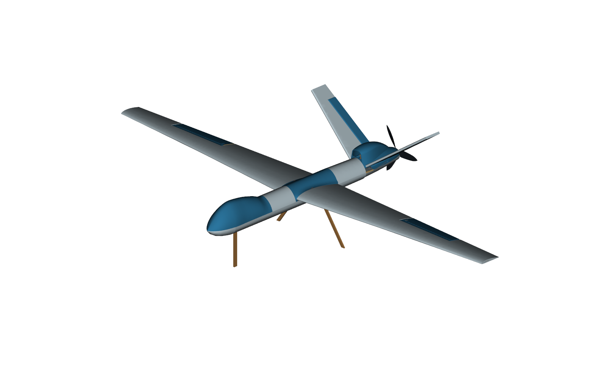
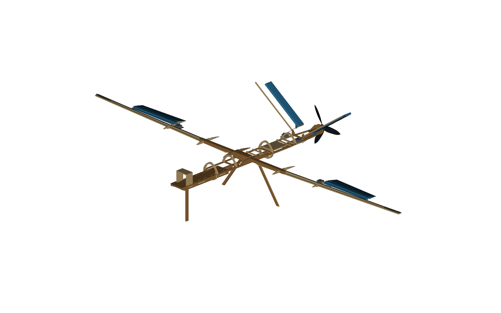

# Reaper: simple prototype build

A rounded, approximately 2 m-span Reaper with removable wings, the existing N1 nose, four control servos and three simple wooden landing legs. Wood carries the loads; foam and printed fairings form the exterior. The propeller is a purchased-hardware reference, not a print file. Attach the three existing wheel/axle assemblies to the leg ends; their actual offsets are not modelled.

This is a digitally checked prototype design. The workshop fit, joints, actual weight/balance, controls and exact propulsion combination still need the checks at the end. CAD alone does not establish that the aircraft will fly safely.

## Files and materials

| File or folder | Use |
| --- | --- |
| Cutting/ | Combined stock-sheet DXFs, previews, sheet register and part-to-sheet map. |
| Print/ | 14 new print files and the orientation/settings schedule. Reuse N1. |
| CAD/ | Positioned assembly and individual finished parts. Stock_Blanks identifies pieces that require sanding after cutting. |
| Reference_Profiles/ | Individual profiles for shop re-nesting; these are not additional parts. |
| Data/ | Complete part list, wiring, mass/balance, calculations, sources and physical-check record. |
| Paper_Patterns.pdf | Optional actual-size manual templates; use the page map and print only needed pieces. |

| Owned stock | Planned use |
| --- | --- |
| Nominal 6 mm plywood, 8 × 4 ft | 1 layout(s), 2438.4 × 1219.2 mm. Body load frame, root joints, firewall and gear. |
| Ten 1000 × 100 × 5 mm balsa planks | 2 planks nested. Wing caps/webs/ribs, body formers, tail spines and small plugs. |
| Ten 1000 × 600 mm FliteBoard sheets | 3 sheets nested. Nominal 5 mm; measure actual thickness and sheet mass. |
| Two solid 5 × 1000 mm carbon rods | One complete rod per wing as the upper spar member. Do not cut them into short joiners. |
| 2 kg HS PLA+ | New print estimate 582 g including reference supports/brims; actual printer result will vary. Existing N1 is excluded from the new print order. |
| Five MG90S; four bicycle spokes | Four servos and four pushrods installed; fifth servo spare. Keep the supplied servo arms/screws. |
| Three existing wheel/axle assemblies | Reuse them with three plain wooden legs. The owner will handle both end attachments; actual wheel offsets and alignment remain workshop checks. |
| Two Velcro straps; glue, tape and ties | Battery retention, tested structural bonds, taped hinges and removable covers. |

Use a ruler/caliper, square, knife, sanding block, drill/reamer, scale, multimeter and wattmeter. Check the actual glue is compatible with each substrate. Test wood/carbon/print bonds; use foam-safe adhesive on exposed XPS. Large glue blobs do not replace a fitted joint.

## Cut and print

1. Measure stock thickness and test kerf/slot fit on offcuts first. Cut from this package only. DXFs use millimetres: CUT is through-cut; SCORE is a separate controlled operation; MARK labels parts; STOCK_REFERENCE_DO_NOT_CUT is never cut. Balsa grain follows the long stock direction in the nesting. Label left/right pieces before separating them.

2. If the shop bed is smaller than the plywood sheet, re-nest complete individual profiles at 100%. Do not scale or split a structural part to fit. Check the final quantities against Part_to_Sheet.csv. Have the shop choose a suitable process for paper-faced XPS; knife/CNC-knife cutting uses the same profiles if laser processing is unsuitable.

3. Foam developments describe the outside paper surface. Form them over the actual ribs/frame, remove inner paper and relieve the inner core locally, bevel seams and protect the outside paper. Local spar/servo pockets and gear exits require the relief instructions and a dry-fit transfer; a flat outline does not make a three-dimensional pocket. Before full wings, make a representative formed section with the real cap/web/rod and deepest cap channel: the nominal model leaves only about0.5mm of outer foam/paper there. Prove you can retain that skin on the actual board; a generic slot coupon is not enough.

4. Follow Print_Schedule.csv per part, at millimetres and 100% scale. It lists the minimum object envelope; allow additional bed space for brim/support. Controls print closed tip down and open root up, with no trapped internal support. Install their balsa plugs after the horns. The two body fairings print front end down with 15% gyroid infill and an 8 mm brim. FCF needs supports everywhere with bridge support enabled; FTF uses buildplate-only supports. Test a 15 mm anchored bridge with the actual PLA+ and printer first. Preview thin walls, horn blocks and support removal before the batch. Do not print the illustrative motor, propeller or wheels.

The tallest new files need about 274.1 mm usable print height, plus the printer's startup clearance. TRC/TLC retain a low-bed-adhesion warning because they are tall and narrow; their 8 mm brim is a starting setup, not proof of adhesion. Verify the actual machine's size, first-layer grip and tall-part stability before ordering the batch.

## Assemble the wooden body

Dry-fit rails FLR/FLL, keel FK, former pieces FF1, FF3, FF0R, FF0U, FF0L, FF2R, FF2U, FF2L, and cross ties FX0L/FX0R plus FX1-FX3. The split former arches and sides are separate labelled pieces supported by the frame; do not glue unrelated pieces together across the battery passage. Fit the wing receiver, motor structure and gear attachments while the underside remains open. Hold the frame square and symmetric, then bond the contacting faces. Foam and removable fairings do not carry these attachment loads.

Fit battery tray FBT, webs FBWL/FBWR and cross tie FBC. Round the strap slots, add a nonslip pad and route both Velcro straps using two slot rows inside the pack footprint. Each strap must restrain the pack without pulling its leads. Fit GPS shelf FGPS and its posts, then prove battery removal: lift N1 and FSU1 together as described below, release/tuck the straps, slide the pack to centre Y-205 to clear the shelf, then lift out. Nominal battery adjustment is Y-280 to -120; actual leads can reduce that range.

Fit equipment deck FEQ on FEC0/FEC1 in the aft service bay, with plugs reachable beneath FSU2. N1 is a taped removable cover and remains unchanged. Tie the pitot to the integral left-forward tab of FBT. For front access, release the tape on both N1 and FSU1, disconnect both labelled pressure tubes and release/withdraw the probe attachment. Lift N1 and FSU1 together, then separate them off the aircraft; their overlapping edges prevent independent straight lifting while the other remains seated. Keep the pressure ports unobstructed and prove the sequence with actual tubing installed.

| Equipment | Simple support and access |
| --- | --- |
| FC and receiver | Pads/ties on FEQ; remove FSU2 for plugs, USB and SD access. |
| ESC | Across the body on FES0/FES1 with pad/ties; remove FSU2. Keep cooling airflow through the fitted covers and test temperature. |
| SiK radio | Pad/ties on FTM0/FTM1; remove FCF and reach from above. Keep its antenna clear of carbon and power wiring. |
| GPS/compass | Pad/ties on FGPS; lift the N1/FSU1 pair for access. Check actual compass interference. |
| Airspeed board | Insulated pad under the tray's rear edge. Lift the N1/FSU1 pair and remove the battery, release the board attachment, slide the board aft to Y−25, then lift out. Keep both pressure tubes reachable and labelled. |

## Wings, tail and controls

Use the current verified register, stock-blank STEP files and DXFs together. A DXF is a cut outline; it does not imply that a curved groove or pocket is a laser through-cut. The original foam patterns describe the outside paper only. New internal relief and the gear exits are separate operations below.

### Datum and material

X runs along the span, Y aft and Z upward. The right wing begins at X53; left-hand positions are mirrored. Each carbon upper cap uses one complete owned 5 x 1000 mm solid rod. Balsa caps are about 900 mm long, webs about 800 mm, so normal 2 mm stock-end margins fit the 1000 mm boards. Keep grain along the cap/web/spine length and along each rib chord. Keep the root-tongue plywood face grain spanwise; the bending screen assumes this orientation. Measure actual plywood, balsa and foam thickness before accepting the nominal fits. Rib outside perimeters include 0.4 mm assembly/glue clearance; fill it continuously with the qualified adhesive while holding the outside foam profile. Rib beam windows are full-depth cut profiles using the larger clearance needed at either stock face; fill the small angular mismatch continuously with adhesive. The separate root tongue/receiver bearing keeps its specified fit. A dry gap is not a bonded load path.

### Beam and removable root

1. Cut the **stock blanks** for LCR/LCL (5 mm balsa), WBR/WBL (5 mm balsa), and the six JR/JL laminate blanks (6 mm plywood). The finished STEP models also show secondary grooves; these grooves are not all present in the flat DXF. Keep a comparison print of the finished section beside the blank.
2. Support the lower cap and web in the rib/root jig before shaping the thin web end. Sand the half-round carbon seat progressively with a 5 mm former and thin abrasive. The web rises to the rod centre, giving a real curved glue surface. Do not replace this with a line-contact rod sitting on a flat edge. Dry-fit the actual rod; account for abrasive thickness and glue clearance. The last approximately 100 mm uses a shallow groove directly in the lower cap, where the rod and cap meet and the web ends.
3. Mark the diagonal rod channel on each root laminate using its finished STEP/template. Fit that relief before bonding the three layers around the protected rod/jig. Do not drill an unplanned transverse hole through the highly stressed tongue. The nominal finished tongue is 18 mm wide; its receiver is 18.3 mm. Recalculate the receiver gap from the measured laminated thickness and a sliding coupon rather than forcing nominal sheets into it.
4. Bond continuously along the rod/web, web/cap and tongue/cap overlap. The carbon rod is the upper cap, not a loose alignment pin. Keep the removable receiver free of glue. The top and bottom receiver caps transfer vertical load by bearing; its side cheeks alone cannot do that.
5. The centre fairing must remain removable for retention and wiring access. Use one captive, replaceable 3 mm nylon tie per wing through the root-rib slot and the corresponding fixed JB cheek slot. Root-rib slots lie at Y135-139 / Z10-12; fixed cheek slots at X33-37 or X-37 to-33 / Z11-13. Smooth char and sharp edges. The tie bears on plywood, not foam. Tighten only enough to seat the wing. Check the actual tie size/strength and test withdrawal. For removal, lift the centre cover, unplug the servo and cut the tie, then withdraw the wing straight along the span. Fit a new tie on reassembly.

The final fixed JF/JB cheeks stop at X-50 and X50, matching the bearing caps and 50 mm engagement per wing. Their former outboard guide extensions are removed so they cannot strike the removable root ribs. The larger existing inner-foam clearance remains an access void; it needs no replacement part and is not a structural glue joint.

### Foam relief map

Do not transfer a 3D pocket onto an arbitrary side of a flat pattern. Dry-assemble the beam, ribs and root, protect them from accidental glue, then wrap the correctly labelled foam pattern around that jig. Mark contact lines on the **inner face** with removable transfer colour. Open the foam again, remove inner paper only inside the marked relief, and pare/sand gradually while checking the unchanged outside profile against the jig. Outer-paper protection is essential; a gouge through it is a repair decision, not an acceptable hidden fit.

| Installed foam | Outer-paper pattern | New feature and transfer method |
|---|---|---|
| WLIN / WRIN | F01 / F02 | Root tongues, receiver cheeks and plywood root rib: transfer their actual dry-fit contact outlines to the inner face. The source DXF does not contain these pockets. Keep the outer paper and original rounded nose/section. |
| WLIN / WRIN | F01 / F02 | Lower cap starts 47 mm outboard of the physical wing root (global X100), follows Y=80+0.04*abs(X), and is 20 mm wide. Nominal bottom Z=2.6+0.008*abs(X) leaves about 0.5 mm of the original lower foam/paper. Check a section coupon; do not simply remove the full foam thickness. |
| WLOUT / WROUT | F04 / F03 | Continue the same lower-cap channel and carbon upper-cap contact relief using the assembled straight rod as the transfer jig. The rod is progressively closer to the upper skin toward the tip; preserve the outside paper and check residual foam. The tip rod seat is in wood, not an overlapping stack of rod and balsa. |
| WLOUT / WROUT | F04 / F03 | Dry-fit AHL/AHR at the fixed aileron edge (approximately abs(X)496-770, Y123-147). Transfer the actual rail contact to the inner face and pare the marked seat to the finished STEP pocket. Preserve continuous upper outside paper. Where the modeled seat opens at the lower/trailing edge, cut only that marked opening and bond the printed rail as the local replacement edge; do not enlarge the opening into the main wing skin. Clamp the tape landing straight while the joint cures. |
| WLIN/WLOUT and WRIN/WROUT | F01/F04 and F02/F03 | The relocated aileron servo body is about X455-487, Y111-143 (mirror X for left). Mark the actual body/tray during dry fit. Internal body clearance differs from a through opening: expose only the underside tie/arm service area required by the actual servo. Keep the wing upper surface and main beam intact. The supplied arm requires the separately modeled underside sweep opening and open tray edge; use Data/Arm_Clearances.json and CAD/Reference_Clearances (clearance references, not parts to make). Confirm the actual arm centre plane about 1.65 mm beyond the shaft tip, not a point inside the shaft. Tail trays also have an open outboard edge for their arms. |
| TLF / TRF | F06+F08 / F05+F07 | Transfer the actual balsa spine contact to the inner tail foam before gluing. Its cut pocket must seat the spine; it must not merely overlap it in the assembly. Retain the outside tail contour. |
| TLF / TRF | F06+F08 / F05+F07 | At the root, transfer ETL/ETR servo body and TROOT crosshead contact using the assembled tray/crosshead as the jig. Remove inner paper and foam only within those marks, to the finished STEP pockets. Preserve the exposed outside tail paper; do not cut a broad access hole through it. Leave the actual servo ties and arm accessible from the removable rear-cover opening. |
| TLF / TRF | F06+F08 / F05+F07 | Bevel the fixed trailing-edge underside for control and horn travel. Mark a line 3 mm below the hinge axis, measured normal to the canted tail surface, then pare a 20-degree bevel from the square edge toward the underside/leading side. Apply it only over the moving-control span: right hinge datum (45,492.6,27.81) toward (267,492.6,183.25), span coordinate -1 to266 mm; mirror left. Keep the upper tape landing uncut. Use the finished STEP and tail_travel_relief.json as the jig limits, then cycle the actual taped control and horn through the full mixed +/-20-degree limit. This is a fixed-foam trim; do not reshape the printed control or horn. |
| FSL body pieces | Body pattern IDs in Data/Cut_Patterns.csv | Landing-leg exits are intentional through openings, unlike the internal wing grooves. Dry-fit the three owned-hardware support sticks and mark their actual exit at the current assembled position. The old body DXFs do not include those exits. Owner handles leg and wheel attachment details. |

Use the per-part finished STEP and stock blank as the limits for secondary shaping. Stop if fitting would require cutting the outer paper away or thinning a structural wood ligament beyond that model. That is a geometry/material mismatch to resolve before gluing, not permission to force the fit.

The source tail-servo undersides intrude locally by 0.022 mm into the nominal MTR/MTL seat. This is a measured CAD residual, not a claim of zero interference. Lightly dress the balsa seat by at most 0.03 mm where the actual servo touches, then check flat support and tie retention. The cut blank remains a flat 5 mm part; no hidden laser depth pocket or servo-axis shift is specified.

### Controls and printing

The fixed aileron rail and thin tape landing are one connected print per side. The moving controls retain the source outline, with the documented hinge changes. Each moving shell prints upright from its closed outboard end with its inboard end open; fit the separate balsa closure only after inspecting/assembling the horn. Both control families have a gradual internal printing ramp; each slicer preview must show no floating internal starts. The outboard tip is trimmed 1 mm and closed with a planar 0.8 mm floor for an actual flat bed footprint. Use an 8 mm brim and verify the actual printer height; the reference slicer bed is not evidence that the owner’s printer fits. Do not use inaccessible trapped support as an automatic repair.

The AR/AL STLs are intentionally **unslotted print blanks**. Their finished positioned STEP files include the 3.2 x 17 mm transverse horn slot. Print the CAD material with 100% rectilinear infill; the actual hollow airfoil cavity remains empty. After printing, use the inboard-end/leading-edge top-view locator DXF to mark the slot, then cut/file it and test the actual horn. This avoids an unsupported internal roof. The locator is not a developed curved-surface template. Four separately printed horns key into reinforced slots. The tail horns have X-axis pins at neutral and an hourglass bore (nominal 2.4 mm throat over 1 mm; 4.4 mm mouths) for a nominal 2 mm spoke. Measure the actual spokes and printed throat. The captive servo-end Z-bend needs 3 mm usable axial movement, with both ends still retained; a tight ordinary Z-bend is not the modeled articulation. Check the entire combined rudder/elevator sweep under load for rubbing, binding, pull-through and wear.

The digital linkage starting limits are ailerons +/-15 degrees and total mixed V-tail motion +/-20 degrees. They are not independent +/-20-degree pitch plus yaw commands. The final aileron linkage needs approximately -36.5/+48.0 degrees of servo rotation for those +/-15-degree surface limits; a default +/-45-degree radio setup is not enough in one direction. Measure the actual available travel and set a smaller surface limit if necessary. Do not force an endpoint. Centre each real servo electrically before bending the final spoke ends. Theoretical reachability does not establish the real arm hole radius, free play, printed bearing durability or flight control settings.

## Landing gear and motor

Use three plain wooden legs: one end attaches to the existing wooden body underside, the other to an owned wheel/axle assembly. The owner will take care of these attachments. No custom forks, axle carriers, extra brackets or steering system are included. Carry each attachment into wood, with the wheel assemblies aligned for straight rolling.

Use the owned plywood for these replaceable legs. The nominal main-leg end meets only about 6 × 6 mm of rail; do not use that small butt contact as the completed landing joint. Fit a small flat plywood offcut underneath to spread the load along the wooden frame, and retain the leg with replaceable ties. The leg reaches the frame through a small skin exit; no unbacked end should bear on foam. Tape can stop slipping but does not replace the wood bearing surface. The owner fits this simple load-spreading attachment along with the wheels; it is not represented as a proven joint by the three leg blanks. A tied joint is not automatically a calibrated breakaway device: provide and test an outward/backward release path on a spare representative joint, including its skin opening, to see whether it releases or damages the frame first. A hard impact can still damage the aircraft. The owned PLA+ has not been qualified for impact-loaded landing legs.

Keep the supplied wheel and axle hardware. Use the closest-matching pair for the main wheels and the third at the nose; adjust the stick lengths to their assembled heights so the body sits level. Reserve all four bicycle spokes for the control pushrods. If a supplied wheel assembly swivels, its final attachment must hold the intended straight wheel direction for the fixed-gear setup. The overview shows nominal leg ends, not measured wheel axle positions.

Align all wheel planes parallel to the centreline and axles square. Check free rotation, side play and a slow straight roll. With the finished aircraft loaded, hold 10 degrees nose-up and rotate the actual prop through a full revolution: require at least 20 mm clearance throughout. Adjust leg length to the actual wheel-assembly offset before final attachment. Recheck after load testing for bending and joint movement. The model does not promise clearance at every pitch angle.

Fit FMGB, FMGL/FMGR, FMT and firewall FMF with all intended load faces touching. The motor mounts behind FMF using its actual supplied screws through four holes on a 19 mm pitch circle. Check screw engagement, shaft relief and adapter fit. Check pusher prop orientation/handedness and motor rotation; keep the prop removed for wiring and initial direction tests.

The propeller's front face still faces the aircraft's nose in this rear-motor arrangement, and its leading edges must lead in the selected rotation direction. Confirm the actual Gemfan markings and adapter fit rather than copying another maker's hub details. The secured propulsion test must produce airflow aft and forward thrust, with the nut remaining secure; airflow direction alone does not prove a backwards-mounted blade is correct.

## Close the exterior

Form FSL0-FSL3 and the four lower-nose gores FNG1-FNG4 around the frame. Fit the small hand-shaped FNT tip and dry-fit the unchanged N1 before bonding the lower nose. Use the pattern-to-assembly map to avoid mixing the mirrored wing and tail skins. Transfer local gear exits from the dry assembly without weakening wooden members.

Fit FCF and FTF around their actual clearance pockets. Keep FSU1/FSU2 as taped service covers for battery straps and equipment plugs. Keep the wing connectors reachable through FCF and the tail servos reachable through their local FTF openings. Repeat wing removal, battery removal and linkage checks with the complete exterior installed.

Dry-fit FCF and lift it through its first 5 mm of travel. It can brush the inner wing foam edge by about 0.18 mm; lightly dress that local mating edge by up to 0.2 mm until the cover lifts freely. Leave the printed fairing and wooden root structure unchanged, and recheck with the actual covering/tape fitted.

Dry-fit the FSU2 cover over the tail-servo trays. Transfer each tray edge to the cover's aft edge and cut two small through-notches, about 7 mm wide and 2 mm deep, centred near X=±49.5 mm at Y389.65. Add only the clearance needed by the real trays. Lightly dress the mating right-side foam edges at FSU2/FSL2, FSL3/tray and FTF/FSL3; modeled seam overlaps are at most 0.21 mm. Dress the nose seam only if needed. These are local foam-fitting operations, not cuts into wooden supports or permission to thin the surrounding outer skin.

## Wiring and setup

See the wiring table below and Data/Connections.csv for each route. Measure lead lengths along the fitted route, include connector access and secure them away from hinges, wheels, moving linkages and the propeller.

Keep the propeller off. Check the labels and pin order on the actual F405-WING V2 and every adapter before applying battery power. Use the FC's regulated 5 V rail for the receiver and sensors; use its separate Vx rail at 5 V for the four servos. Bridge Vx to Vx2 so the tail-servo outputs receive power. Verify loaded voltage at every servo plug.

Meter the disconnected ESC signal lead: its listing conflicts about whether it has a BEC. For this wiring plan, connect ESC signal and common ground only, and insulate any powered ESC positive lead. Do not parallel it with FC 5 V or Vx. The FC 5 V regulator is rated 2 A; the servo regulator is rated 5 A continuous/6 A peak. Check the actual combined loads.

| FC label | Connection | Initial setting |
| --- | --- | --- |
| Battery/PDB input and motor feed | Battery through current sensor to ESC | Verify polarity and lead rating |
| S1, G | ESC signal and ground | `SERVO1_FUNCTION=70` |
| S3, Vx, G | Left aileron | `SERVO3_FUNCTION=4` |
| S4, Vx, G | Right aileron | `SERVO4_FUNCTION=4` |
| S5, Vx2, G | Left V-tail | `SERVO5_FUNCTION=79` |
| S6, Vx2, G | Right V-tail | `SERVO6_FUNCTION=80` |
| RX2, 5V, G | iA10B servo iBUS, not SENS | `BRD_ALT_CONFIG=0` |
| TX3/RX3, 5V, G | M9N GPS; cross TX and RX | `SERIAL3_PROTOCOL=5` |
| DA2/CL2, 5V, G | M9N compass and ASPD I2C | `ARSPD_TYPE=1`, `ARSPD_BUS=1` initially |
| TX1/RX1, 5V, G | SiK radio; cross TX and RX | `SERIAL1_PROTOCOL=2` if the pair supports MAVLink2 |

Leave S2 and S7-S10 unused with their functions set to 0. The nose wheel is fixed and has no steering servo. M9N needs both UART and I2C. The ASPD connector sequence is 5V, SCL, SDA, GND; verify its orientation. Check the actual radio's voltage, draw and cable mapping.

1. Confirm the V2 board and supported MatekF405-Wing firmware, then record the version. Use ordinary compatible PWM outputs. The S1/S2, S3/S4 and S5/S6 pairs share timer groups.
2. Mount the FC on aft deck FEQ at (0, 270, 13.5) mm and the receiver at (0, 315, 14.35) mm, using the simple pads/ties. Remove FSU2 for USB/SD and plug access. The FC's long dimension runs across the body: check its arrow and configure board orientation accordingly.
3. Use a plain transmitter airplane model with V-tail mixing disabled. Bind the receiver, enable servo iBUS and calibrate the radio channels. Centre servo arms mechanically before setting travel limits.
4. In MANUAL, right roll must give right aileron up/left down; pitch-up must give both V-tail trailing edges up; right yaw must move both V-tail surfaces right. Review 79/80 assignment if one tail axis is wrong, or output reversal if both axes are wrong. Do not accept the numbers without checking the surfaces.
5. In FBWA with sticks centred, tilting the aircraft right must command left aileron up/right down; tilting the nose up must command both tail surfaces down. Check yaw correction, then test combined full pitch/yaw and aileron travel for binding. Monitor servo-rail voltage and save the verified parameters.
6. Start V2 battery monitoring with `BATT_MONITOR=4`, `BATT_VOLT_PIN=10`, `BATT_CURR_PIN=11`, `BATT_VOLT_MULT=11.0` and `BATT_AMP_PERVLT=66.7`; calibrate against a meter/known load. Verify GPS, compass, telemetry and gentle pitot response.
7. Set the chosen RC-loss and battery failsafe actions, including `THR_FAILSAFE=1`. With the propeller off, verify actual RC-loss detection, mode change, restoration and throttle cut. Confirm the logged battery-failsafe behaviour. RTL depends on a healthy GPS, valid home and a suitable route.

Label both wing-root disconnects and keep their service loops clear of retention joints. Keep high-current pairs together and away from the compass and receiver. Measure the finished harness; the long battery-to-PDB route needs the actual ESC maker's lead/capacitor guidance before extending input wires. Mount the ESC on its wooden supports with usable inlet/outlet airflow, and check temperature with the real covers fitted.

## Calculations in plain terms

| Quantity | Estimate and meaning |
| --- | --- |
| Finished mass | 2.55 kg nominal; material/installation assumptions span 2.12-3.15 kg. |
| Wing | 0.3043 m² exposed area; 169.8 mm mean aerodynamic chord; 83.7 g/dm² loading at nominal mass. |
| Balance | Estimated CG Y=79.7 mm at nominal battery centre Y-154. Y increases aft in the CAD coordinates. |
| Analysis balance reference | 20% MAC is Y=74.2 mm; it is not a flight-approved CG. Estimated required pack centre Y=-181.7 mm; within the modeled adjustment range. |
| Tail | Pitch-effective area 0.0483 m²; tail-volume estimate 0.343. This is a geometry screen, not a stability certificate. |
| Wing bending screen | At nominal mass and a3g reference load, the central assumed-stiffness model predicts about 106 mm tip deflection. This excludes joint slip, torsion, buckling and nonlinear response; it is not a structural pass. |
| Ground loads | Using nominal leg stations, nose reaction is 13.0% and each main 43.5% of static weight. Actual wheel offsets can change this. |

Mass is the sum of parts and equipment. CG (centre of gravity, the balance point) is sum(mass × position) divided by total mass. Wood uses assumed density; foam uses developed blank area and assumed board mass per area; printed parts use sliced object extrusion, excluding supports. Weigh actual parts and the completed aircraft to replace those assumptions. The 3g structural scenario means three times normal weight as distributed lift; it is a calculation case, not a tested manoeuvre rating.

Stall scenarios use V = square-root(2 × weight / (air density × wing area × assumed maximum lift coefficient)). The assumed lift coefficients are 0.8, 1.0 and 1.2; actual stall speed is unmeasured. Power scenarios use assumed drag and propulsive efficiency and cannot predict this motor/prop combination's thrust or flight duration. Structural calculations assume stated material properties and ideal bonds; joint and material proof tests remain necessary.

The Emax motor sheet lists 6-7 inch propellers; the owned 9 inch three-blade is outside that published range. This 4S combination has no measured current/thrust/temperature result here. The 40 A ESC rating alone does not establish a safe operating point or runway takeoff capability. Test the exact combination with a secured rig and appropriate instruments; check cooling and screw/adapter security. Change the prop/setup if the measurements do not support it.

## Finish and verify physically

| Check | Required result |
| --- | --- |
| Stock and manufacture | Measured thickness/kerf, representative slot, foam-forming and print/bond samples fit without forcing. |
| Structure | Root bending/torsion/withdrawal, spar bonds, tail, battery, firewall and gear withstand the agreed proof loads without cracks or permanent movement. |
| Access and controls | Wings/battery/nose removable; all four controls move freely through combined commands and return to neutral; no rod escape or horn/tape movement. |
| Electrical | Correct polarity, isolated ESC BEC positive if present, stable servo power, sensor health, RC range, throttle cut and tested failsafe/recovery. |
| Weight and balance | Weighed completed aircraft and measured CG with the actual pack, prop, wheels, cables and covers. Review the final CG and control authority with the pilot. |
| Propulsion and ground run | Measured current/thrust/temperature, loaded prop clearance and straight taxi on the intended runway. Small wheels require a suitable smooth surface. |
| First flight | Experienced fixed-wing pilot, suitable site/weather, confirmed abort/landing plan and conservative manual/control checks before automated modes. |

Record results in Data/Physical_Checks.csv; a blank means untested. Complete prop-off configuration first. Runway takeoff remains conditional on the actual propulsion, taxi, clearance and pilot checks. Research examples inform construction methods; they do not validate this aircraft's performance. Exact references and the limits of the DIY video review are in Data/Sources.md.
