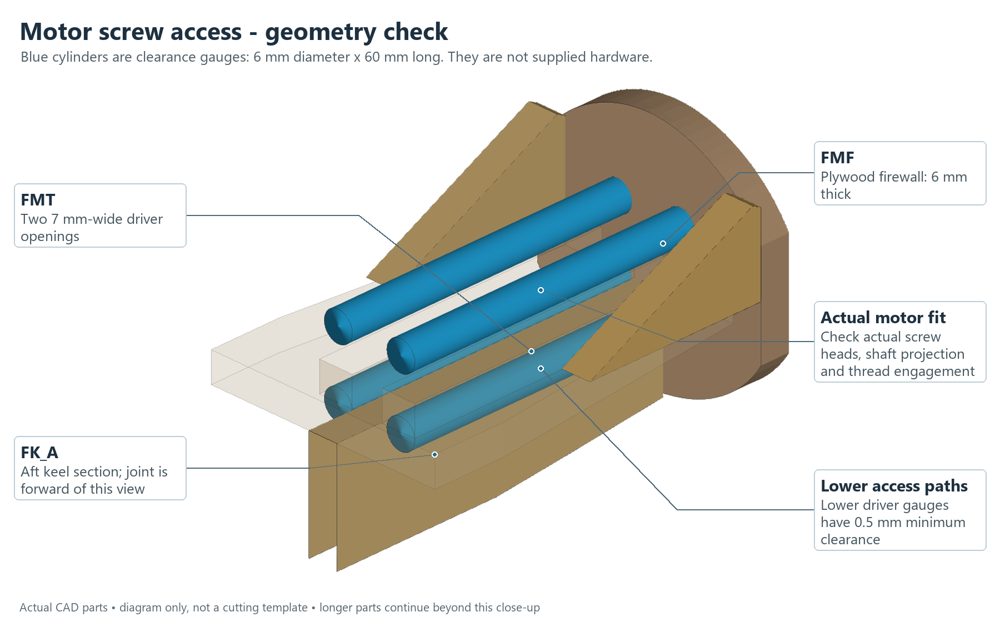
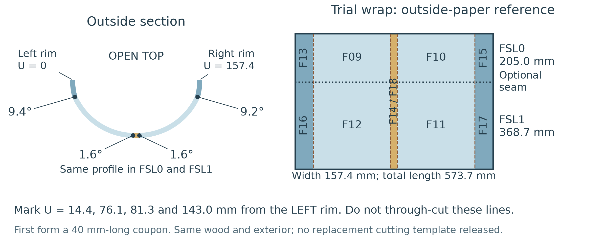
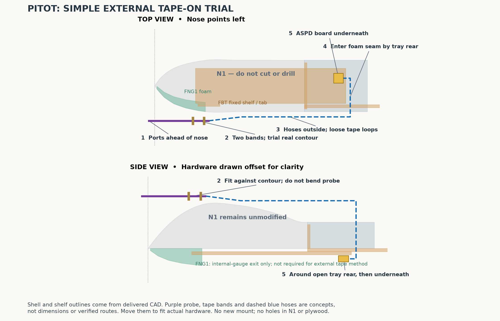
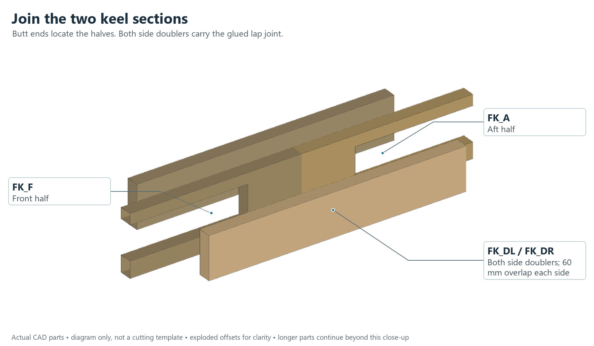
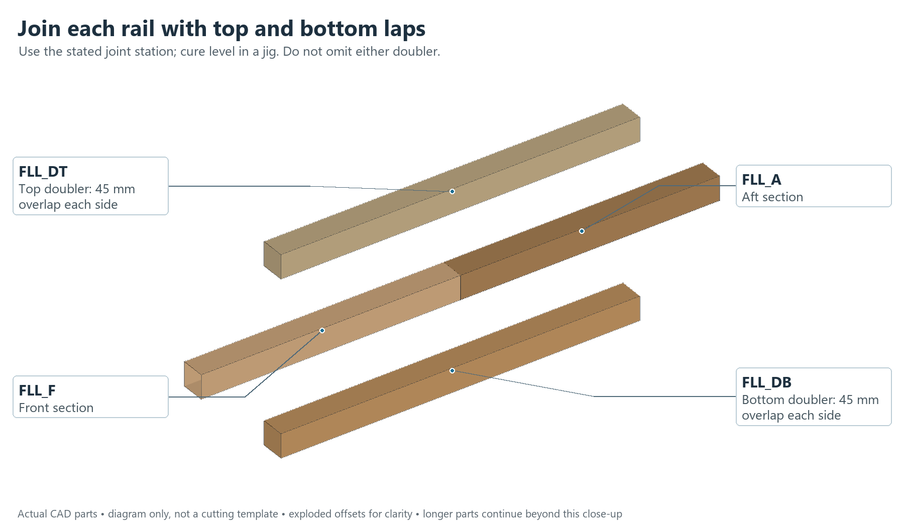
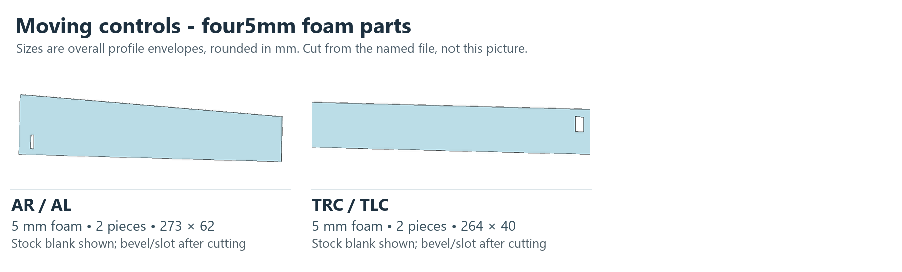
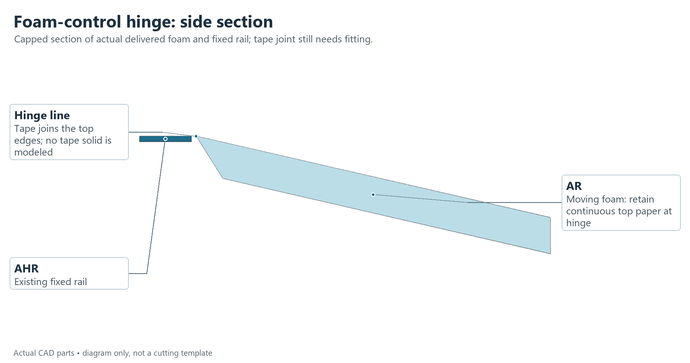
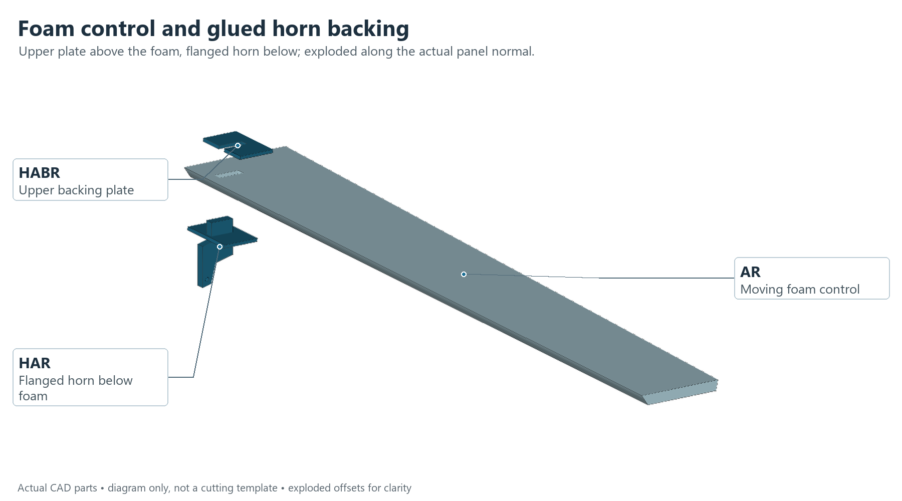
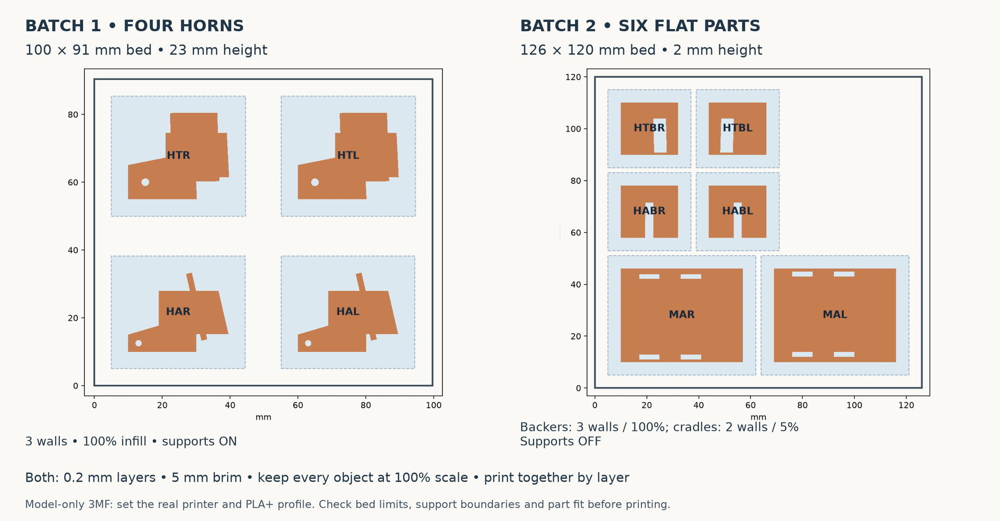
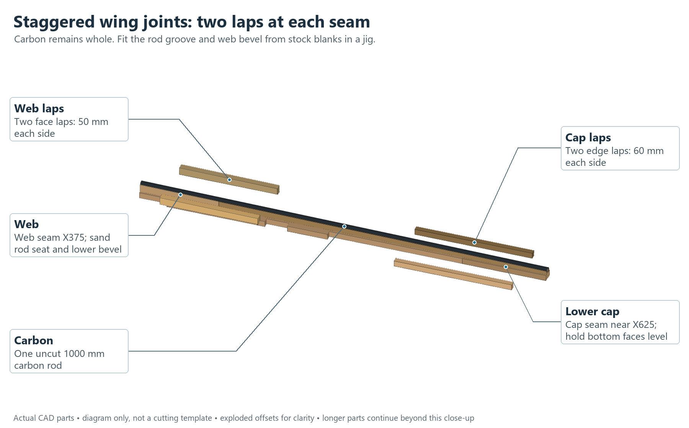

# Reaper: illustrated workshop build guide

## Build the Reaper

**REV4 - ALL PLYWOOD / FOAM CONTROLS** Use the new 609.6 x 457.2 mm plywood panels, test layer first. Join the body and wing members with every reinforcing plate. Moving ailerons and tails are now 5 mm foam. Real joints, foam forming, controls and propulsion still need the checks in Buildability_Audit.md.

Finished shape with the owned 9045 three-blade propeller shown as a reference. Fit your three wheel assemblies to the plain legs; their dimensions are not modelled.

| Before you build | What we know |
| --- | --- |
| Size / estimated flying weight | 2.0 m span / 2.66 kg including flight battery. Build sensitivity: 2.20-3.30 kg. Weigh the finished model. |
| Estimated stall speed | 39-50 km/h (10.8-14.0 m/s), at 2.66 kg under stated lift/air-density assumptions. Not a measured flight speed. |
| Flight time example | 15-17 minutes IF whole-flight average current is 15 A. Actual current is unknown; see next page. |
| Runway / launch | Required runway length is UNKNOWN. Planned method: wheeled roll from a smooth runway after ground testing. No qualified hand launch or catapult. |

**Resolve before a powered launch** The Emax 2807 motor is listed for 7-inch props. The owned 9-inch three-blade combination has no verified current, thrust or temperature result. The build files do not establish flight readiness.

## Flight numbers, without guessing

Battery time: capacity divided by average current

4S 5200 mAh = 5.2 Ah, about 77 Wh at nominal voltage. The examples use 70-80% of rated capacity and leave 20-30% unused. Pack condition and voltage sag may shorten them.

| Assumed whole-flight average | Calculated time |
| --- | --- |
| 10 A | 21.8-25.0 min |
| 15 A | 14.6-16.6 min |
| 20 A | 10.9-12.5 min |
| 25 A | 8.7-10.0 min |

Minutes = 60 x 5.2 x usable fraction / average amperes. Include launch, climb, servos and electronics. These are conditional examples, not a prediction of cruise current.

Stall: the slowest speed assumed to hold level flight

Wing area is 0.304 m2; loading is about 87.4 g/dm2. Vs = square root of [2 x mass x gravity / (air density x wing area x maximum lift coefficient)]. Assumed maximum lift coefficient: 0.8-1.2; air density: 1.10-1.225 kg/m3.

39-50 km/h is airspeed, not GPS ground speed. Turns, gusts and a heavier build raise the requirement. Including the full mass sensitivity gives about 35-56 km/h. Do not target stall during the maiden flight.

Runway: no defensible minimum yet

| Illustration only: reach 18 m/s in still air | Ground roll only |
| --- | --- |
| Assume 1 m/s2 net acceleration | 162 m |
| Assume 2 m/s2 net acceleration | 81 m |
| Assume 3 m/s2 net acceleration | 54 m |

Distance = speed squared / (2 x net acceleration). Acceleration is unmeasured. These examples exclude obstacle clearance, climb and stopping after an aborted takeoff. 18 m/s is not an approved takeoff speed.

**Launch plan** First prove propulsion, structure, balance and straight low-speed rolling. An experienced RC pilot then sets the operating speeds, field and abort plan. Do not chase these example speeds in an unqualified ground run.

## The whole job at a glance

| Order | Do this | Files in this package |
| --- | --- | --- |
| 1  CUT WOOD | 87 plywood pieces; no balsa. Count 87, plus 5 plywood test pieces. | Cutting/ sheet DXFs; Workshop_Plywood_REV4/ shop instructions |
| 2  CUT FOAM | 39 flat patterns. Knife or CNC knife; form and trim inner pockets by hand. | Cutting/ foam sheet DXFs; individual files in Reference_Profiles/ |
| 3  PRINT | 14 new PLA+ parts. Reuse the existing N1 nose. | Print/ individual STLs; Print/Print_Schedule.csv |
| 4  DRY-FIT + GLUE | Body -> wing beams -> ribs/skins -> tail/controls -> covers/legs. | Illustrated steps in this guide; CAD/Reaper_Assembly.step |
| 5  FIT + WIRE | Owned electronics, four servos, four spokes, two whole carbon rods, three wheel assemblies. | Placement, wiring and setup pages below |
| 6  CHECK | Count, fit, balance, electrical tests, propulsion test and supervised ground checks. | Data/Guide_Parts_Checklist.csv; Data/Physical_Checks.csv |

**One checklist for the workshop** Data/Guide_Parts_Checklist.csv lists every cut pattern and new print, quantity, individual file and cutting sheet. Tick it as parts arrive. Individual reference profiles are alternatives to sheet layouts, not extra parts.

Find the next job

Parts and cutting: pages 4-15.
Assembly and intermediate pictures: pages 16-31.
Electronics placement, wiring and setup: pages 32-39.
Balance and launch checks: pages 40-41. Terms: page 42.
Motor screws: 43. Body-wrap trial: 44. Pitot trial: 45.
Frame joints: 46. Foam controls: 47-48. Print batches: 49. Wing lap joints: 50.
Read Buildability_Audit.md before using these reference files.

CAD = the positioned 3D model. DXF = a flat cutting file. STL = a print mesh. R and L mean aircraft right and left when looking forward from the tail. All files use millimetres at 100% scale.

## Lay out the stock and owned parts

| Have ready | Use |
| --- | --- |
| 6 mm plywood panels, 1.5 x 2 ft | 2 layouts, each 609.6 x 457.2 mm; 87 aircraft pieces + 5 tests. Face grain follows the marked arrows. Measure actual stock. |
| Ten 1000 x 600 mm FliteBoard sheets | Three nested sheets; 39 flat patterns. Measure thickness and sheet mass. |
| Two solid 5 x 1000 mm carbon rods | Use one full rod in each wing. Do not make short centre joiners. |
| 2 kg HS PLA+ / existing N1 nose | About 473 g for new prints with estimated supports/brims. Reuse N1. |
| Five MG90S / four bicycle spokes | Fit four servos and four spokes; one servo stays spare. Keep factory arms/screws. |
| Three wheel/axle assemblies | Reuse the supplied wheels and axle hardware. Three plain plywood legs. |
| Two straps / ties / tape / adhesive | Two battery straps; tape hinges/covers; tested joints and simple equipment retention. |

Tools: ruler/caliper, square, knife, sanding block, drill/reamer, scale, soldering tools, multimeter and wattmeter. Use motor/prop supplied hardware; no new generic fastener kit is specified.

**Make three trials first** Test stock-slot fit; a formed wing section with its deepest beam pocket; and real wood/carbon/foam/PLA adhesive joints. Use foam-safe glue on exposed foam. Thin, fitted joints beat large glue blobs.

## Cut once, label every piece

**Plywood: use the complete REV4 panel set** Cut TEST_CUT_FIRST and check stock/kerf/lamination fit before CUT_AIRCRAFT. These 2 panels contain all 87 plywood aircraft pieces, including body and wing joint reinforcements. Do not use REV3 with the smaller stock.

1.  Give the shop Cutting/Sheet_Register.csv, Part_to_Sheet.csv and the matching DXFs. Keep every part ID on its cut piece.

2.  Measure plywood and foam. Test the cutting width (kerf) and slot fit on an offcut before the complete sheet.

3.  Plywood layers: TEST_CUT_FIRST, then CUT_AIRCRAFT. Disable LABEL_DO_NOT_CUT and STOCK_DO_NOT_CUT for through-cutting. Foam files use CUT and MARK; their stock outline is not cut.

4.  If the laser bed is smaller, re-nest whole individual profiles from Reference_Profiles/. Keep scale at 100%. Do not split a structural part just to fit the bed.

5.  Use knife/CNC-knife for the paper-faced foam unless the shop has established a suitable process. Protect the outer paper; internal pockets are hand-fit later.

6.  Count 87 plywood aircraft pieces; no balsa; keep the 5 plywood test pieces separately. The four new moving-control patterns are flat; trial forming of the other body/wing patterns before the full cut. FNT remains a hand-shaped offcut.

**Grain and finishing matter** Keep plywood face grain spanwise in wing caps, webs, lap pieces and root tongues; chordwise in ribs. Follow the panel grain arrows. Some laser-cut blanks still need grooves or sanding: use CAD/Stock_Blanks for the starting shape and CAD/Parts for the finished shape.

Optional paper cutting

Paper_Patterns.pdf is a tiled, actual-size template set. Find the needed part in Data/Paper_Page_Map.csv. Print only needed pages at Actual Size / 100%; measure the scale bar. Plywood templates now include all REV4 joint pieces. Curved skin templates still require forming trials; the four moving-control profiles are flat cutting patterns.

## Wing wood parts - both wings

Each listed ID is one piece. Paired groups may show one representative; use each named file and pick every ID listed. Images are not cutting templates.

Wood shades identify parts consistently across pictures; they do not mean different wood species. Match IDs to Data/Guide_Parts_Checklist.csv. Blanks still need finishing. Reuse N1; it is not one of the 14 new prints.

## Tail and landing-leg wood parts

Each listed ID is one piece. Paired groups may show one representative; use each named file and pick every ID listed. Images are not cutting templates.

Wood shades identify parts consistently across pictures; they do not mean different wood species. Match IDs to Data/Guide_Parts_Checklist.csv. Blanks still need finishing. Reuse N1; it is not one of the 14 new prints.

## Printed parts - 14 new prints + reuse N1

Each listed ID is one piece. Paired groups may show one representative; use each named file and pick every ID listed. Images are not cutting templates.

Wood shades identify parts consistently across pictures; they do not mean different wood species. Match IDs to Data/Guide_Parts_Checklist.csv. Blanks still need finishing. Reuse N1; it is not one of the 14 new prints.

## Body wood parts - group 1 / REV4

Each listed ID is one piece. Paired groups may show one representative; use each named file and pick every ID listed. Images are not cutting templates.

Wood shades identify parts consistently across pictures; they do not mean different wood species. Match IDs to Data/Guide_Parts_Checklist.csv. Blanks still need finishing. Reuse N1; it is not one of the 14 new prints.

## Body wood parts - group 2 / REV4

Each listed ID is one piece. Paired groups may show one representative; use each named file and pick every ID listed. Images are not cutting templates.

Wood shades identify parts consistently across pictures; they do not mean different wood species. Match IDs to Data/Guide_Parts_Checklist.csv. Blanks still need finishing. Reuse N1; it is not one of the 14 new prints.

## Body wood parts - group 3 / REV4

Each listed ID is one piece. Paired groups may show one representative; use each named file and pick every ID listed. Images are not cutting templates.

Wood shades identify parts consistently across pictures; they do not mean different wood species. Match IDs to Data/Guide_Parts_Checklist.csv. Blanks still need finishing. Reuse N1; it is not one of the 14 new prints.

## Match the 39 foam patterns

Four new flat moving-control profiles include horn slots and bevel-reference lines. The other 35 are body/wing references. Page 44 gives a simpler lower-body wrap trial; prove forming and inner pockets first.

| Assembled skin | Flat patterns to pick | Count |
| --- | --- | --- |
| FNG1-4 - FNG1-4 | FNG1, FNG2, FNG3, FNG4 | 4 |
| FSL0 - Forward lower body | F09, F10, F13, F14, F15 | 5 |
| FSL1 - Middle lower body | F11, F12, F16, F17, F18 | 5 |
| FSL2 - Rear lower body | F19, F20, F21, F22, F33 | 5 |
| FSU2 - Removable rear upper cover | F23, F24 | 2 |
| FSU1 - Removable front upper cover | F25, F26 | 2 |
| FSL3 - Four-strip lower body shell | F27, F28, F29, F30 | 4 |
| WLIN - Left inner wing | F01 | 1 |
| WRIN - Right inner wing | F02 | 1 |
| WROUT - Right outer wing | F03 | 1 |
| WLOUT - Left outer wing | F04 | 1 |
| TRF - Right fixed tail | F05, F07 | 2 |
| TLF - Left fixed tail | F06, F08 | 2 |
| AR / AL - AR / AL | AR, AL | 2 |
| TRC / TLC - TRC / TLC | TRC, TLC | 2 |

The foam sheet previews in Cutting/ show the exact flat shapes and labels. Several flat pieces form one curved skin: 39 patterns do not mean 39 assembled shells. The extra FNT nose tip is a hand-shaped offcut.

**Preserve the outside** Mark contact pockets on the INSIDE while dry-fitting. Remove only the inner paper and needed foam. Bevel mating seams gradually. Keep the outer paper and the finished outside contour intact.

## Foam shapes / 1 of 2

Exact flat DXF outlines, each labelled with pattern / assembled skin / quantity. Solid line = cut; orange dashed line = score. Shapes are independently scaled to fit these boxes.

Use the actual DXFs or full-size paper templates for cutting. These pictures are for finding and counting parts, not tracing. Match each piece to the preceding foam map.

## Foam shapes / 2 of 2

Exact flat DXF outlines, each labelled with pattern / assembled skin / quantity. Solid line = cut; orange dashed line = score. Shapes are independently scaled to fit these boxes.

Use the actual DXFs or full-size paper templates for cutting. These pictures are for finding and counting parts, not tracing. Match each piece to the preceding foam map.

## Print the right parts the right way

| Pick from Print/ | Qty | Use |
| --- | --- | --- |
| FCF / FTF | 2 | Removable body fairings |
| AHR / AHL | 2 | Fixed aileron rails |
| HAR / HAL / HTR / HTL | 4 | Revised horns with broad lower flanges |
| HABR / HABL / HTBR / HTBL | 4 | Upper foam-control backing plates |
| MAR / MAL | 2 | Wing servo cradles |

1.  Print these 14 parts; reuse N1. Do not print AR/AL/TRC/TLC: they are now foam. Do not use the old horn STLs.

2.  Use the batch model(s) for the small parts on page 49. They preserve separate objects; the shop must set its printer, material and the listed per-object settings. They are not machine G-code.

3.  Print revised horns in their exported orientation with accessible external supports. Use 0.2 mm layers, 3 walls and 100% infill. Backers print flat; see the exact schedule and support-removal check.

4.  The unchanged aileron rails need about 274.1 mm height in their upright orientation. The nose-clearance description is not an exact printer specification; the shop must confirm the selected arrangement fits.

5.  FCF/FTF: front end down, 0.2 mm layers, 2 walls, 15% gyroid, 8 mm brim. FCF supports everywhere with bridge support; FTF buildplate-only supports.

**Try one horn and backer first** Remove supports, fit the actual 5 mm foam and both glue faces, and check the spoke hole and full travel before printing the rest. Keep support material out of the bore and key fit. Do not stretch or scale parts to make them fit.

## Mark the body before assembly

Measure stations aft from the FRONT TIP of FK_F. Keep rails level on supports; the uneven FK bottom is not a level datum.

| Front face / reference | Station from FK_F tip |
| --- | --- |
| FK_F front tip / battery shelf front | 0 / -20 mm |
| FX0L/R front / FF0 front / FF1 front | 205 / 204.5 / 329.5 mm |
| FX1 front / receiver JF front / JB front | 335 / 402.55 / 426.85 mm |
| FX2 / FF2 front; FX3 / FF3 front | 568.65 / 568.65; 719.65 / 718.65 mm |
| TROOT front / motor plate FMF front | 779 / 919 mm |
| Provisional balance line / pack centre | 409.16 / about 178.9 mm |
| Pack centre for removal | 130 mm; slide toward this mark, then lift |

These are longitudinal marks, not glue-face heights. Use the side view and positioned CAD for height and orientation. CAD coordinates: X across wings, Y aft, Z up. Station = CAD Y + 335 mm.

## 1. Build the straight body base

Nose: lower left. Tail: upper right. Rails begin205mm behind the FK front datum.

Pick: FK_F + FK_A + FK_DL + FK_DR + FLL_F + FLL_A + FLL_DT + FLL_DB + FLR_F + FLR_A + FLR_DT + FLR_DB + FX0L + FX0R + FX1 + FX2 + FX3 (17 IDs, one each)

1.  Mark a straight centreline on a flat board and cover it with release film. Sort each front/aft pair and its two reinforcing pieces.

2.  Join FK_F/FK_A with BOTH side doublers. Join each left/right rail pair with BOTH top and bottom doublers. Use page 46 for stations and overlap. Cure straight in the jig before adding crosspieces.

3.  Support the completed rails at equal height with their top faces level. Hold the joined keel upright; its uneven lower edge is not the levelling datum.

4.  Fit the cross strips at the marked stations. Check top and side alignment, then glue their touching faces. Keep every reinforcing piece fitted.

**Check before moving on** The frame sits square on the jig. Left and right match. No part needs force to reach its shown position.

The butt ends only align the sections. Both glued reinforcing pieces carry each joint. Do not use hot glue or an unreinforced butt joint here.

## 2. Add the body ribs and battery shelf

Keep the three pieces of each split former together.

Pick: FF0L + FF0R + FF0U + FF1 + FF2L + FF2R + FF2U + FF3 + FBT + FBWL + FBWR + FBC (12 IDs, one each)

1.  Fit the eight 6 mm plywood body-rib pieces by their FRONT faces: FF0 at station 204.5 mm, FF1 at 329.5 mm, FF2 at 568.65 mm and FF3 at 718.65 mm. Measure aft from the FK_F front tip; do not align centres.

2.  Fit FBWL and FBWR, the battery-shelf side supports, into the matching rib notches. Add FBC and shelf FBT.

3.  Keep the battery opening clear. Do not join the split rib pieces across this opening.

4.  Round the strap-slot edges. Dry-fit a 2 mm nonslip pad, the battery and both owned Velcro straps before gluing.

**Check before moving on** The real battery slides without catching. Two straps fit through slot rows about 80 mm apart within the battery length.

FF0 and FF2 remain split around the battery opening. Use the final plywood profiles; old 5 mm rib stations and stock are superseded. Battery straps remain the restraint.

## 3. Add the equipment shelves

The equipment goes on these shelves and strips.

Pick: FGPS + FGPL + FGPR + FEQ + FEC0 + FEC1 + FES0 + FES1 + FTM0 + FTM1 (10 IDs, one each)

1.  Fit GPS shelf FGPS on its two posts FGPL/FGPR in the nose bay.

2.  Fit FEC0/FEC1 across the aft body, then add FEQ, the flight-controller and receiver shelf.

3.  Fit FES0/FES1 as the two ESC support strips. Fit FTM0/FTM1 for the telemetry radio.

4.  Set the real equipment on its supports with temporary pads/ties. Check plug access before any covers go on.

**Check before moving on** USB, memory card, receiver plugs and ESC leads remain reachable. Nothing hangs into a control linkage.

Install electronics later. This step checks the empty shelves and the real equipment fit.

## 4. Fit the wing socket and motor support

Fit the combined base and two gussets. Use the motor’s supplied screws after checking their fit.

Pick: JF + JB + JLOW + JTOP + FMF + FMT + FMGL + FMGR (8 IDs, one each)

1.  Dry-fit lower plate JLOW and side walls JF/JB. Try a measured three-layer tongue sample BEFORE bonding upper plate JTOP.

2.  Adjust the sliding fit, then close the socket. Keep the sample/tongue and sliding space free of glue. Nominal tongue width is 18 mm; socket gap is 18.3 mm.

3.  Fit the corrected combined base FMT to the keel and rails. Add FMGL/FMGR braces and upright FMF. There is no separate FMGB in this revision; keep both 7 mm screwdriver openings clear.

4.  Test the motor and supplied screws on TEST_MOTOR first. Then dry-fit the actual mount: four holes on a 19 mm circle, rotated 45 degrees from the old pattern. See the drilling procedure on page 43. Remove the motor while gluing.

**Check before moving on** Socket and motor plate meet their supports without gaps. The motor screws engage correctly and cannot touch the windings.

A firewall is the motor mounting plate. Keep the propeller OFF during assembly and electrical setup.

## Detail: wing socket

Close the wing socket last

Test an 18 mm three-layer tongue in the 18.3 mm nominal socket before bonding JTOP. Wood thickness and glue change the real fit. Keep the sliding space clean.

## 5. Make both wing beams

Right wing shown. Build the left from its own mirrored part files.

Pick: LCR_I + LCR_O + LCR_DF + LCR_DA + LCL_I + LCL_O + LCL_DF + LCL_DA + WBR_I + WBR_O + WBR_DF + WBR_DA + WBL_I + WBL_O + WBL_DF + WBL_DA + JR1 + JR2 + JR3 + JL1 + JL2 + JL3 (22 IDs, one each)

Two complete 5 x 1000 mm solid carbon rods: CRFULL and CLFULL.

1.  Sort the right/left cap halves, two cap side strips, web halves and two web face plates. All are 6 mm plywood. Keep face grain along the wing; retain each whole 5 x 1000 mm carbon rod.

2.  In a straight jig, join cap halves with BOTH 120 mm side strips, 60 mm each side of the butt. Join web halves with BOTH 100 mm face plates, 50 mm each side. Keep the cap and web joints separated; see page 50.

3.  Use the finished STEP and the whole rod to shape the round rod seats and web lower bevel. Dry-fit continuous web-to-cap and rod-to-web contact; then bond in the jig after the lap joints cure.

4.  Shape only the revised internal rod relief in JR1/2/3 and JL1/2/3. Preserve tongue outer faces, laminate each set of three, then bond it to the matching beam. Keep the receiver sliding faces free of glue.

**Check before moving on** Both reinforced beams are straight and match. All intended bond faces contact continuously; each three-layer tongue fits the body receiver without forcing.

A cap is the lower strip; the web stands above it. Butt ends locate the halves; the paired glued lap pieces carry the joints. No balsa or shortened carbon rods are used.

## Detail: removable wing roots

Make the three-layer wing tongue

Use each cut blank in its own orientation. Shape the carbon seat before lamination. Bond all three layers into one tongue; do not leave dry gaps.

Seat and retain both wings

The root-rib slot and JB slot take a 3 mm retention tie. Release the tie and servo connector before sliding the complete wing out.

Rib front faces, measured out from the physical wing root: 0 mm (root), 194.35 mm (middle), 435.01 mm (outer). Mirror the left wing. Each half has one plywood root rib and two-piece 6 mm plywood middle/outer ribs.

## 6. Fit wing ribs and check removal

Right wing. Ribs are lifted here to show where they seat on the beam.

Pick: WRRI + WLRI + WRRM_1 + WRRM_2 + WLRM_1 + WLRM_2 + WRRO_1 + WRRO_2 + WLRO_1 + WLRO_2 (10 IDs, one each)

1.  Fit the root rib and the four split middle/outer rib pieces on each side. Every rib piece is 6 mm plywood; keep its face grain along the chord. Do not bridge a beam opening.

2.  Set each rib square at the station shown. Hold the wing profile with the jig while the glue cures.

3.  Insert both wings into the body socket. Check equal angles and equal height before adding skins.

4.  Try a 3 mm tie through each root-rib slot and the matching JB slot. To remove a wing later: lift the centre cover, unplug its servo, cut the tie and slide the whole wing out.

**Check before moving on** Both wings seat fully, stay positively retained and withdraw smoothly after releasing the ties.

Ribs are the crosswise wing-profile pieces. Their small perimeter clearance must become a continuous glue joint, not a dry gap.

## 7. Form and fit the wing skins

**AUDIT HOLD** The plywood cap, web and lap plates need local internal foam relief. Prove a representative section and preserve the outside paper; do not force the skin outward.

Right wing: inner patternF02 and outer patternF03. Left usesF01 andF04.

Pick: Foam: WLIN, WRIN, WLOUT, WROUT

Four flat wing patterns: F01 left inner, F02 right inner, F04 left outer, F03 right outer.

1.  First make a short trial section from the real board with the real beam and deepest groove. Prove that the outside paper survives shaping.

2.  Dry-fit MAR/MAL, the real wing servos, centred factory arms and leads before wrapping skins. Mark service openings and disconnect routes.

3.  Wrap each correctly labelled pattern around the dry wing skeleton. Mark beam, rib, root and servo contacts on the INSIDE.

4.  Open the skin again. Remove inner paper only at marked pockets. Pare the foam gradually and refit; keep the outside paper intact.

5.  Bond MAR/MAL to their fitted seats and the fixed aileron rails into the marked rear-edge seats. Glue the skin to its supports while the outside profile stays in the jig.

**Check before moving on** No beam, lap plate or servo pushes the skin outward. Trial the deeper local plywood pockets while preserving the outside paper; reject a thin or torn skin.

The flat foam pattern gives the outside shape. It does not cut the inner pockets for you. Keep servo arms and root ties accessible.

## 8. Build the fixed V-tail

Keep the two spines seated in the fixed foam tails.

Pick: TROOT + TRS + TLS + MTR + MTL (5 IDs, one each). Foam: TRF, TLF

Right foam patterns F05 + F07. Left foam patterns F06 + F08.

1.  Fit TROOT to the body rails. Fit the 6 mm plywood spines TRS/TLS at 35 degrees above horizontal on each side.

2.  Fit the revised 6 mm plywood trays MTR/MTL. The tail servos sit 1 mm higher than before; use the relieved FTF and foam pockets. Dry-fit the real servo flat before bonding.

3.  Transfer spine, tray, servo and TROOT contacts onto the inside of the tail foam. Shape these pockets, then dry-fit foam controls and horns before bonding the foam.

4.  Bevel the fixed trailing-edge underside. Start 3 mm below the hinge line, measured perpendicular to the canted panel, and pare 20 degrees from the square edge. Keep the upper tape landing.

5.  Prove the full mixed control travel with temporary hinges, then glue the fixed foam in its jig.

**Check before moving on** Tail halves match at 35 degrees. The foam moving tail and horn can swing through the full combined +/-20-degree range without rubbing.

The tail neutral pin-to-pin reference is now 88.250 mm, before spoke bends. Measure the real centred linkage; keep the retained sliding allowance and test full mixed travel.

## Detail: tail hinge clearance

Make room for tail movement

Bevel the fixed foam underside only. Preserve the upper tape landing. Test the horn as well as the control surface through the full combined travel.

## 9. Fit hinges, horns, servos and spokes

**AUDIT HOLD** Do not copy the vertical aileron-arm position in the reference CAD. Trial the arm about 15 degrees forward, then fit the spoke at neutral. This improves calculated travel margin; prove the real retained bends and full movement before use.

Right underside close-up; foam and ribs hidden. Use the supplied servo arm.

Pick: AR + AL + TRC + TLC + AHR + AHL + HAR + HAL + HTR + HTL + HABR + HABL + HTBR + HTBL + MAR + MAL (16 IDs, one each)

Four MG90S servos, four factory arms and four bicycle spokes. Keep the fifth servo as a spare.

1.  Cut AR/AL/TRC/TLC from 5 mm foam using their new flat profiles and horn slots. Mark TOP and the hinge edge. They are no longer printed.

2.  Bevel the inside leading edge to the 5 mm reference line, keeping the upper paper. Maintain 0.7 mm aileron and 1.5 mm tail hinge gaps; tape both faces. See page 47.

3.  Fit each revised horn from below and its slotted backing plate above. Bond both broad flanges to the paper and glue the key into its backer. Old horns and end plugs are not used. See page 48.

4.  Centre servos electrically. Index downward aileron arms about 15 degrees toward the nose and secure their screws. Measure each spoke at the actual neutral position before bending.

5.  Fit captive spoke ends. Tail neutral pin spacing is 88.250 mm before bends; its end still needs 3 mm retained sliding movement through the arm hole. Secure the arm on its shaft and test all combined stick corners.

**Check before moving on** Start at no more than +/-15 degrees on ailerons and +/-20 degrees TOTAL on each mixed tail. No rubbing, rod escape, tape peeling or servo buzzing.

The flat foam section changes the former printed camber. Use the shown neutral position, then check trim and loads. The forward-indexed aileron setup needs about -36.4/+36.0 degrees from its new neutral for +/-15 degrees surface travel.

## Detail: tail linkage

Fit the tail surfaces as a pair

The flight controller mixes elevator and rudder commands. Start with neutral arms and check both mixed axes before setting endpoints.

Keep the spoke ends captive

Use the four owned spokes and factory servo arms. Do not assume the spoke thread is M2. Measure and bend to the actual centred linkage.

Trial aileron setup: electrically centre the servo, then index its downward arm about 15 degrees toward the nose. Measure each rod anew; nominal pin-centre length is 31.2 mm before bends. Tail reference: 88.250 mm after the 1 mm servo rise with 3 mm retained sliding movement at the spoke end. Keep arms screwed firmly to their shafts. Prove actual bends and full travel.

## 10. Close the body and prove access

N1 + FSU1 lift together. Keep the centre and rear covers removable.

Pick: Foam: FSL0, FSL1, FSL2, FSL3, FSU1, FSU2, FNG1, FNG2, FNG3, FNG4

Existing nose N1; printed covers FCF/FTF; one hand-shaped FNT nose-tip offcut, 13 x 7 mm.

1.  Dry-fit GLEG_L/R/N to the frame first. Mark and cut their exits in the lower foam before bonding the skins.

2.  Match the flat body patterns to the skin map. Form lower skins and four nose strips around the frame. Bevel seams and preserve their outside paper.

3.  Round the small FNT offcut to close the last nose gap. Dry-fit your existing N1 before bonding the lower nose.

4.  Fit the removable covers with tape. Transfer the revised tray/spine/servo relief from the final STEP onto the mating foam; dress only the local inside contact and preserve the outside paper.

5.  Check cover removal before closing. N1 and FSU1 lift off TOGETHER after releasing both tapes and the pitot/tubes. FCF may need up to 0.2 mm local inner-wing foam edge fitting.

**Check before moving on** Battery, wings, plugs and servos remain accessible. Unplug the battery, release straps and slide the pack centre to the removal mark, 130 mm behind the FK front tip, then lift it out.

Dress only the marked foam mating edges. Keep structural wood intact. Do not permanently glue service covers shut.

## 11. Add the simple wheels and propulsion

Owner fits the wheel assemblies and load-spreading offcuts/ties.

Pick: GLEG_L + GLEG_R + GLEG_N (3 IDs, one each)

Three owned wheel/axle assemblies, small plywood offcuts, ties, actual motor/prop hardware.

1.  Fit each plain leg between the body frame and its owned wheel assembly. Spread the body-end load along wood with a small flat offcut and ties.

2.  Measure the complete wheel offsets BEFORE trimming legs. Shortening a leg lowers clearance. Set wheels straight and the body level; lock any swivel.

3.  Install the motor without its prop. Finish the prop-off electrical checks. Then disconnect the battery and temporarily fit the actual prop for clearance checks.

4.  With the loaded plane held 10 degrees nose-up, turn the prop by hand through a full circle. Require at least 20 mm ground clearance, including flex; adjust before final leg attachment.

**Check before moving on** The plane rolls straight. Wheels turn freely. Attachments cannot punch into unsupported foam. Propeller and tail clear the ground.

There is no designed bungee hook or catapult fitting. The basic plan is a tested smooth-runway takeoff; see the launch page.

## Place the electronics

Placement map, not a PCB pin layout. Nose to the left; motor at the rear.

| Item | Support / access |
| --- | --- |
| GenX 4S 5200 mAh | FBT shelf, nonslip pad, two straps. Lift N1 + FSU1 together. |
| M9N-5883 GPS / compass | FGPS shelf above forward battery; antenna face up. |
| ASPD-4525 / pitot | Board under tray rear; external tape-on probe trial on page 45. Label both hoses. |
| SiK 433 air radio | FTM0/FTM1 under FCF; antenna clear of carbon and power wiring. |
| Matek F405-WING V2 / FS-iA10B | FEQ deck: FC forward, receiver behind it. Remove FSU2. |
| ReadytoSky 40 A / Emax ECO II 2807 1300KV | ESC across FES0/FES1 with airflow; motor behind FMF. |
| Four MG90S servos | MAR/MAL wing plates; MTR/MTL tail trays. Keep arms and root plugs accessible. |

Use simple pads and ties. Protect solder joints and restrain leads. FC long side runs across the body: read its actual arrow/top face before setting orientation. Keep USB, SD card and plugs reachable. Test cooling with covers fitted.

For the pitot trial, keep N1 intact. Trial tape retention on its outside and route hoses through a foam-cover seam. The real probe, taper, hoses and cover clearance decide the fit; see page 45.

## Wire power and the four servos

Follow actual board labels and polarity. A line marked + / - carries two conductors; each servo lead has signal, supply and ground.

1.  Battery main leads go to the FC battery INPUT pads; ESC supply goes to the FC ESC OUTPUT pads. This keeps current flowing through the board current sensor.

2.  S1 and ground go to the ESC signal input. Any ESC BEC positive stays disconnected and individually insulated. Motor phases go to the motor; swap any two only with power disconnected if direction is wrong.

3.  Leave S2 and S7-S10 unused. Leave 9 V, 12 V and video pads empty. The battery balance plug is not an FC supply.

4.  Keep power leads together and clear of sensors. Measure the battery-to-PDB lead length; follow the actual ESC maker's input-lead/capacitor guidance.

PDB = board power distribution pads. Vx = regulated servo supply; Vx2 is its second output bank. Set 5 V and bridge the labelled Vx/Vx2 pads with power removed. Insulate any ESC BEC positive; do not parallel it with the FC supply.

## Connect GPS, compass and airspeed

TX = transmit; RX = receive. SDA/DA and SCL/CL are the two I2C sensor-bus wires. The two pitot lines are hoses, not electrical wires.

1.  GPS TX goes to RX3; GPS RX to TX3. Compass DA/SDA goes to DA2; CL/SCL to CL2. Both GPS and compass connections are needed.

2.  The ASPD board shares DA2/CL2 with the compass. Its pin order is 5V-SCL-SDA-GND; verify which way the real connector faces.

3.  Label both hoses. Connect pitot total pressure to the sensor total-pressure port and static pressure to static. Check the actual kit diagram; do not rely only on a nipple being above or below.

4.  Keep hose bends open and all pitot openings exposed. Leave enough tube for the removable nose. Keep the GPS away from high-current wire loops.

**Use regulated power** GPS, compass and ASPD use the labelled 5 V and ground supply, never raw 4S battery voltage. Follow pin labels, not connector colours.

## Connect the receiver and telemetry

FS-i6X and the SiK ground radio stay on the ground. USB is for setup; telemetry must also work without the FC USB cable.

1.  Use the receiver SERVO iBUS output, not SENS. Its signal goes to RX2; supply comes from FC 5 V and ground. Keep BRD_ALT_CONFIG=0 for this route.

2.  Cross TX1 to air-radio RX and RX1 to air-radio TX. Verify the actual SiK voltage, connector pinout and transmit current before connecting its 5 V supply.

3.  Attach radio antennas. Keep receiver antenna tips clear of carbon and power wiring. Label wing servo disconnects; leave a service loop without loose wires near linkages.

4.  Use common grounds. Check the 2 A electronics budget and 5 A continuous / 6 A peak servo budget under real load; a USB-only test is not enough.

**Before the first power-up** Remove the propeller. Check every + and ground with a meter. Check connector orientation on the real receiver, GPS, sensor and radio. USB power alone cannot prove the battery-powered rails.

## Set up and test 1-3

Use Mission Planner on Windows. Connect the FC with a USB data cable, choose its COM port and Connect. SETUP may be called INITIAL SETUP; CONFIG may be CONFIG/TUNING.

1. Inspect and power

Prop off. Check labels, soldering, polarity and no +/G short. Meter disconnected ESC lead; insulate any BEC positive. Set Vx=5 V and bridge Vx2.

PASS: Correct polarity and about 5 V at every low-voltage plug on battery power; no unexpected heating.

IF NOT: Disconnect; correct pins/short/jumper. Never parallel ESC BEC with FC 5V or Vx.

2. Firmware and orientation

In Mission Planner, load supported stable ArduPlane MatekF405-Wing (V2 needs 4.4+); record version. Read fitted FC arrow/top face; set AHRS_ORIENTATION in Full Parameter List.

PASS: Displayed attitude follows nose-up/right-roll correctly; USB/SD remain accessible.

IF NOT: Fix target or board rotation first; do not compensate with servo reversal.

3. Accelerometer

Mission Planner Accel Calibration: disarmed, complete all six positions, holding still at each prompt. Then use Calibrate Level in intended level flying attitude.

PASS: Calibration accepted; level aircraft displays level.

IF NOT: Repeat on firm support; check orientation. Level-only is not full calibration.

| Mission Planner task | Menu |
| --- | --- |
| Firmware | Disconnect the software link; SETUP > Install Firmware. |
| Board rotation / named settings | CONFIG > Full Parameter List. Search, edit, Write Params; reboot when required. |
| Six-position / level calibration | SETUP > Mandatory Hardware > Accel Calibration. |

A new FC without an ArduPilot bootloader needs the official first-install procedure before normal firmware updates. Use the Matek/ArduPilot links in Data/Guide_Sources.md.

## Set up and test 4-6

4. Compass

Mission Planner Compass: calibrate outdoors away from metal/tools, with GPS/compass fixed in final orientation. Reboot if requested.

PASS: Accepted calibration; smooth heading changes matching known directions.

IF NOT: Move magnetic wiring/material; correct orientation and recalibrate.

5. Radio

Plain FS-i6X airplane model; transmitter V-tail mix off. Bind iA10B and select servo iBUS/RX2. In Radio Calibration, move all sticks/switches. Assign MANUAL and FBWA in Flight Modes.

PASS: Inputs match sticks, reach endpoints and centre reliably; modes switch correctly.

IF NOT: Fix input map/reversal or iBUS port, before changing surface outputs.

6. Output map and neutral

Set SERVO1_FUNCTION=70 (ESC); SERVO3_FUNCTION=4 (left aileron); SERVO4_FUNCTION=4 (right aileron); SERVO5_FUNCTION=79 (left V-tail); SERVO6_FUNCTION=80 (right V-tail). Set SERVO2_FUNCTION and SERVO7_FUNCTION through SERVO10_FUNCTION to 0. Use compatible PWM. Secure centred arms; adjust pushrods before trim.

PASS: Four surfaces neutral; no steering output; motor stopped at minimum/disarmed.

IF NOT: Correct output map/linkage/trim. Shared timer pairs must use compatible protocols.

Menus: SETUP > Mandatory Hardware > Compass, Radio Calibration or Servo Output. Flight Modes may be under Mandatory Hardware or CONFIG. Use Full Parameter List for exact SERVOx_* values.

**What the modes mean** MANUAL: your sticks drive the surfaces through the configured mixing. FBWA: the controller stabilizes roll and pitch; you still control throttle. FBWA is not automatic navigation.

## Set up and test 7-9

7. Direction and travel

MANUAL: right roll gives right aileron up/left down; pitch-up gives both tail trailing edges up. Right yaw, viewed from behind: left tail trailing edge up/right; right tail down/right. FBWA: tilt right gives left aileron up/right down; nose-up tilt gives both tails down. Test mixed corners.

PASS: Correct responses; no buzz/binding/horn movement. Initial ceilings: ailerons +/-15 degrees, total mixed V-tail +/-20 degrees, subject to real linkage.

IF NOT: Wrong direction: output reversal. V-tail one mixed axis wrong: exchange 79/80; both wrong: reverse output. Reduce MIN/MAX if binding.

8. ESC and motor

Identify ESC protocol/manual after RC/output setup. If its PWM manual specifies high/low teaching: prop off, FC on USB, battery disconnected; select MANUAL and arm as required, set throttle high, connect battery, wait specified calibration tone, then lower throttle immediately. Wait confirmation; disconnect and restart at low throttle. DShot/CAN needs no endpoint calibration.

PASS: Maker acknowledgement; normal reboot gives stopped idle and smooth start. Brief restrained test confirms pusher rotation.

IF NOT: Stop on unknown type/tones. Follow actual ESC manual, not Copter motor wizard. Power off before phase swapping.

9. GPS and telemetry

Obtain GPS fix outdoors. Connect ground SiK to computer; match baud/protocol. Check radio telemetry without FC USB.

PASS: Healthy fix, plausible position and continuously updating radio data.

IF NOT: Check TX/RX crossing, power, antennas, baud and protocol.

GPS: SERIAL3_PROTOCOL=5. SiK: SERIAL1_PROTOCOL=2 if both ends support MAVLink2; match their baud rate. Set named values in CONFIG > Full Parameter List. Never choose a baud rate without checking the actual radio.

## Set up and test 10-12

10. Airspeed

Set ARSPD_TYPE=1 and ARSPD_BUS=1. Loosely cover pitot against wind at startup; warm at least 1 minute, then use PREFLIGHT CALIBRATE > Do Action to zero. Uncover; apply gentle airflow/pressure.

PASS: Healthy sensor; near-zero still air, rise with airflow, return afterwards. Small 0-3 m/s noise can be normal.

IF NOT: Check supply, I2C, hoses/leaks/kinks; repeat zero without wind. Do not blow hard. This does not calibrate airspeed ratio.

11. Battery and rail load

Start BATT_MONITOR=4; BATT_VOLT_PIN=10; BATT_CURR_PIN=11; BATT_VOLT_MULT=11.0; BATT_AMP_PERVLT=66.7. Calibrate against meter/known safe load. Move four servos together under representative load.

PASS: Voltage/current agree with reference; no reset/dropout; loaded rails remain within device ratings.

IF NOT: Fix V2 scales/current-sensor path or resistive joints. Failed capacity needs isolated supply review, not parallel BEC.

12. Failsafes and save

Set throttle cut, THR_FAILSAFE=1 and selected RC-loss/low/critical-battery actions. Prop off: switch transmitter off, wait the configured loss timer, then restore it. For a bench battery-trigger check, temporarily set the trigger above measured pack voltage; record action, then restore normal thresholds and reboot. Do not deeply discharge the pack.

PASS: Ground station detects each loss/trigger, applies chosen action and recovers as planned. Throttle cut stops motor. Save parameters/results.

IF NOT: Correct receiver loss reporting or action/timer settings. Held-last throttle fails. Confirm short/long actions separately; ground tests do not prove the airborne RTL path.

Menus: SETUP > Optional Hardware > Battery Monitor / Airspeed; named BATT_* and ARSPD_* values are also in Full Parameter List. Failsafe controls may be under Mandatory Hardware; use the parameter list for exact actions/timers.

## Balance, load and service checks

Balance the whole model, not the empty shell

1.  Fit the actual flight battery, covers, prop, wheels and all wiring. Weigh the complete model and record the result.

2.  Mark the provisional balance line 409.16 mm aft of the FK front tip (CAD Y = 74.16). Support both sides at this line without damaging the wing.

3.  Move the battery to balance. The revised calculation starts near centre station 178.9 mm (CAD Y about -156.1). Tighten both straps and recheck. Do not add ballast before measuring.

4.  Check left-right balance and neutral surfaces. Have an experienced builder/pilot review the actual CG and stability before flight. The provisional 20%-of-MAC target is not flight-tested.

**Structural checks still matter** Proof-test the real wing roots, carbon bonds, tail, motor support and battery restraint with an experienced builder. Inspect for cracks, peeling, permanent set and movement. The idealised beam model predicts about 106 mm tip deflection at 3 g: it is not strength qualification.

Prove the three service jobs

| Job | Pass |
| --- | --- |
| Battery | Release N1/FSU1 tapes and pitot/tubes; lift covers together. Unplug the battery, release straps; slide pack centre to station 130 mm, then lift. |
| Wing | Lift centre cover; disconnect servo; cut retention tie; slide whole wing out. Refit and retie without damaged wires. |
| Airspeed board | Front covers and battery out; release board attachment, slide aft to CAD Y -25, then lift. Hoses remain reachable. |

MAC means mean aerodynamic chord: a reference wing chord used to describe CG. Here it is about 169.8 mm. Record measurements in Data/Physical_Checks.csv.

## Ground checks and the first launch

| Check off in order | Pass condition |
| --- | --- |
| 1  Airframe and controls | Joints inspected; actual load checks complete; four surfaces move correctly, remain retained and never bind at mixed corners. |
| 2  Propulsion suitability | Resolve the 9-inch prop / 2807 motor mismatch. Secure instrumented test: record loaded voltage, current, thrust, RPM and motor/ESC temperature. Stay within actual component limits. |
| 3  Prop installation | Correct pusher orientation and rotation; real adapter/shaft fit; supplied screws/nut secure. Check full-circle blade clearance with battery disconnected. |
| 4  Loaded gear clearance | At intended nose-up rotation, prop and tail clear the ground. Guide check: at least 20 mm prop clearance at 10 degrees nose-up, including flex. Real wheel offsets matter. |
| 5  Radio / rails / failsafe | Range check per transmitter manual; four loaded servos cause no reset; cut/loss/battery-trigger behaviour recorded. Save parameters. |
| 6  Slow roll | Smooth level clear area, fixed wheels aligned and swivel locked; low-speed tracking stays straight. Predetermine a stop plan. |
| 7  Pilot decision | Experienced RC pilot reviews mass, CG, structure, thrust, field, wind, control authority and abort plan before committing to launch. |

**Basic launch method** Use wheels on a suitable smooth runway only after the checks pass. No hand-launch grip, bungee attachment or catapult release was designed. Automatic takeoff cannot replace these tests. Required runway length and flight time remain measurements to establish.

After each early flight: inspect every joint and hinge, review current/voltage/airspeed logs, record consumed capacity and temperatures, and update the next flight plan. Do not extend duration from a spreadsheet alone.

## Plain-language terms and reference files

| Term | Meaning |
| --- | --- |
| CG | Centre of gravity: the balance point of the complete plane. |
| Spar / web | Wing beam / its upright strip. |
| Former / rib | A crosswise piece that holds the body or wing shape. |
| Fairing | A shaped removable cover; it is not the main load-bearing frame. |
| Horn / pushrod | Surface lever / the spoke connecting it to the servo. |
| Ruddervator | One moving V-tail surface. The controller mixes pitch and yaw into it. |
| ESC / FC | Motor speed controller / flight controller. |
| BEC / Vx | A regulated low-voltage supply / the FC servo-power rail. |
| DXF / STL / STEP | Flat cutting file / print mesh / positioned 3D CAD model. |
| PWM / iBUS | Servo-style pulse signal / the receiver-to-controller digital radio-input link. |
| Roll / pitch / yaw | Bank left/right / nose up/down / turn the nose left/right. |

Use these when a check needs more detail

Data/Guide_Parts_Checklist.csv - every cut/print item and its file.
Print/Print_Schedule.csv - individual print settings and finishing.
Data/Guide_Electronics.json - all 24 wiring groups and 12 setup checks.
Data/Guide_Performance.json - assumptions, scenarios and source links.
Data/Physical_Checks.csv - workshop/test record.
CAD/Reaper_Assembly.step - positioned finished parts.
Data/Sources.md - original design credit and DIY build references.
Data/Guide_Sources.md - board, calibration and calculation sources.

This guide documents a prototype build, not a tested production kit. The digital checks cover geometry and files. Real stock fit, bonds, weight, balance, propulsion and flight remain physical checks.

## Motor screws and drilling

**Use the corrected motor parts** FMT now combines the old base and crosspiece; omit old FMGB. Four 6 mm head/tool gauges clear the corrected mount. Check the actual motor and screws on TEST_MOTOR before assembly. The screws pass through wood and thread into metal.

Blue cylinders show the checked 6 mm-diameter, 60 mm-long driver paths. They are clearance gauges, not extra parts or the actual supplied tools.

1.  Tools: caliper, matching hex driver, drill and a nominal 3.2 mm bit for M3 clearance holes, clamps and scrap backing wood. If accurate holes are laser-cut, drilling those four holes again is unnecessary.

2.  For a manually made corrected plate, transfer the actual motor hole pattern, clamp the loose plate on scrap, and drill square through it. Screws must pass freely through wood and engage the motor metal threads. Do not use wood screws.

3.  Measure the actual plywood and screw length under the head. Through 6 mm wood, an 8 mm screw projects 2 mm and a 10 mm screw 4 mm. Check actual thread engagement and winding/bottoming clearance before choosing; neither length is automatically approved.

4.  Check the central shaft/retainer against the wood. Any required clearance hole or recess needs a measured drawing. Do not arbitrarily enlarge the centre hole or countersink for the wrong head type.

5.  Fit the motor with the propeller removed. Tighten the four screws evenly according to the motor instructions. Confirm full seating, free bell rotation, reachable heads and no trapped wires. Reinspect after a secured motor test.

The existing dimensioned EMAX drawing shows a 19 mm hole circle. Verify it on the real motor; store text saying 19 x 19 is ambiguous. The M5 nut secures the propeller, not the motor to the wood.

## Trial a larger body-foam wrap

One or two broader wraps can replace ten narrow lower-body strips. This preserves the intended exterior and all wood. First prove the forming method on actual stock.

1.  Start with paper, then a 40 mm-long foam coupon. Nominal outside width is 157.4 mm. Mark LEFT and the four crease positions shown. Leave a little extra at both rims for fitting; do not cut the crease lines through.

2.  Peel the inside paper only. Gently roll the broad curved bands over a smooth former; keep the narrow bottom band flat. Form the small marked changes in angle from the inside, preserving continuous outside paper.

3.  Compare both ends with Data/Foam_Forming_Trial/outer_section_reference_1to1.svg. Print at 100% and check its 100 mm bar. Trial any needed inner relief gradually; reject tears, buckling or a shape forced against the frame.

4.  After a sound coupon, trial one 573.7 mm-long wrap or two lengths of 205.0 and 368.7 mm. Mark actual wood contacts inside, pare only needed pockets and dry-fit covers before gluing. Keep N1/FSU1 removable.

**What this resolves** The diagram supplies panel order, width and crease positions. It does not establish knife depth, adhesive performance or a successful full-length build. Do this trial before cutting the existing reference foam set. Keep F14/F18 as part of the broad sheet, not discarded area.

Data/Foam_Forming_Trial/method.md lists the remaining body-piece mating order and detailed trial steps. The cutting-pattern count is now 39; the trial wrap is an alternative, not extra skin.

## Fit the pitot with tape first

CAD shell outline with a proposed external probe and hose route. Hardware is offset for clarity. Fit the real parts; this picture is not a drilling template.

1.  Battery out. Hold the probe outside the left side of N1, pointing straight forward. Keep its front opening clear and every side hole at least 10 mm ahead of the nose for this trial.

2.  Use a thin nonslip pad and two tape bands behind the holes. Both bands must support the straight tube on the curved nose without rocking or tilting it. Do not drill or sand N1.

3.  Label total/static hoses. Tape them loosely along the outside to the foam-cover side seam beside the tray rear. If needed, fit a small rounded relief in foam only. Route around the open FBT rear edge to the board underneath.

4.  Leave smooth bends and slack to lift N1/FSU1 and disconnect labelled hoses. Refit covers and battery, check straps and removal, then check probe grip, hose kinks/leaks, sensor zero and gentle-airflow response.

**Fit decides the final position** Unknown probe dimensions prevent a universal mount drawing. If two stable bands and forward alignment cannot coexist, revise placement before cutting. Do not bury pressure holes or squeeze hoses to make it fit. Data/Pitot_Installation.md records the method and internal-route alternative.

## Join the short body pieces

Keel: FK_F + FK_A, with FK_DL and FK_DR on opposite sides. Joint station 460 mm aft of the FK_F front tip. Both side plates are required.

Each rail gets one top and one bottom plate. Left joint station 625 mm; right 637.5 mm. Keep the rail top surfaces level in the jig.

1.  Dry-fit the butt ends straight. Keel plates overlap 60 mm each side of its joint; rail plates overlap 45 mm each side. The butt ends alone are not the load-bearing joint.

2.  Prepare clean bonding faces and use a structural wood adhesive proved on a matching coupon. Follow its mixing, wetting and cure instructions. Do not substitute hot glue at these joints.

3.  Bond both plates continuously, clamp without bending the member or squeezing the joint dry, and let it cure fully on the flat jig. Keep openings and nearby supports clear.

4.  Inspect for gaps, peeling, twist or cracks. Test representative joints and the assembled frame before flight. The digital checks prove fit and contact, not joint strength.

Data/Frame_Joints.md gives exact positions and bond areas. Use both reinforcing plates at every body joint; no extra fasteners are specified.

## Cut and hinge the foam controls

AR / AL are the two ailerons; TRC / TLC are the moving V-tail panels. Cut one of each from the named 5 mm foam profiles, including its horn slot.

Keep the top paper along the leading edge. Bevel only the underside, to the 5 mm reference line. The picture shows the real fixed rail and new foam profile.

1.  Keep both paper faces over the panel. Mark TOP, side and hinge edge before bevelling. Do not cut off the hinge-edge paper or mistake the bevel reference for a through-cut.

2.  Set the shown neutral position. Keep the 0.7 mm aileron / 1.5 mm tail gap; fit tape on both faces without pulling the panel out of line. Check full movement before gluing horns.

3.  Trial the tape on actual paper and clean printed rail. Reject peeling, rubbing or a control that will not return to neutral. These flat panels replace the old printed parts and all four old end plugs.

Flat foam preserves the hinge and projected outline closely, but changes the former curved section. Flight trim, control authority and loaded hinge strength require real checks.

## Spread the horn load into the paper

Horn lower flange below the foam; slotted backing plate above. Exploded offsets show the bonding faces, not assembly gaps.

| Panel | Horn below | Backer above |
| --- | --- | --- |
| AR | HAR | HABR |
| AL | HAL | HABL |
| TRC | HTR | HTBR |
| TLC | HTL | HTBL |

1.  Dry-fit the revised horn through the foam slot and slide its matching upper backer over the key. Both broad faces must sit against intact paper; remove supports and fit without crushing the foam.

2.  Bond the lower flange to lower paper, upper plate to upper paper, and the key to the backer. Use adhesive proved compatible with this foam, paper and PLA. Hold flat and let it cure.

3.  Pull-check the cured attachment, then fit the measured captive spoke. Keep glue out of its hole. Sweep both stick axes, including combined corners, and inspect for paper lift or horn rocking.

Use revised horn/backer pairs only. A key glued into bare foam without the two broad backing faces is not this attachment. See Data/Foam_Controls.md for actual fit, motion and remaining physical checks.

## Print the small parts together

Separate named objects in model-only 3MF files. Layout dimensions include the stated brim and margin allowance; choose the actual printer in the slicer.

1.  Open the model-only 3MF file(s) in Print/Batches. Keep units in millimetres at 100%. Do not scale the layout to fit a smaller bed.

2.  Check the plate envelope against the shop machine. Set the material and per-object settings from Print/Print_Schedule.csv and Print/Batches/Batch_Printing.md; a model-only 3MF does not carry a complete printer profile.

3.  Preview the sliced first layers, supports, bore openings and every part. Print one revised horn/backer first if their actual fit has not yet been tried, then run the remaining batch.

4.  Remove accessible supports before fitting. Count four horns, four backing plates and two servo cradles. Print the two fairings and two fixed rails separately as scheduled; reuse N1.

**What we know about the printer** The owner says the nose fits with at least 20 mm clearance on every side. That helps estimate room but does not identify the machine or printing orientation. The shop must confirm the final bed, height, nozzle and material settings. No machine-specific G-code is supplied.

## Build both wing lap joints

Cap joint: paired side strips. Web joint: paired face plates. Both pieces are required at each joint; butt faces only locate the halves.

| Each half-wing | Joint / overlap |
| --- | --- |
| Cap: _I + _O with _DF + _DA | 625 mm from centreline; 60 mm each side |
| Web: _I + _O with _DF + _DA | 375 mm from centreline; 50 mm each side |

1.  Use a flat release-covered jig. Keep all cap pieces on one lower datum and the web straight. Follow spanwise plywood face grain; do not align the two joints at one station.

2.  Dry-fit both lap pieces at each joint. Prepare clean faces, apply the qualified structural wood adhesive over the complete contact, clamp without twist or dry glue lines, and cure fully.

3.  Shape the rod seat and web lower bevel from the finished STEP, using the actual 5 mm rod as a fitting gauge. Never laser a round groove through the stock. Preserve the tongue exterior.

4.  Dry-fit the cured cap, web, whole rod and root tongue together, then bond their continuous contacts. Test representative lap coupons and the assembled wing/receiver before covering.

There are 16 beam/lap pieces across both wings, plus six root laminates. Two whole 5 x 1000 mm rods remain. Geometry and stiffness calculations do not prove joint strength, peel resistance or flight loads.
