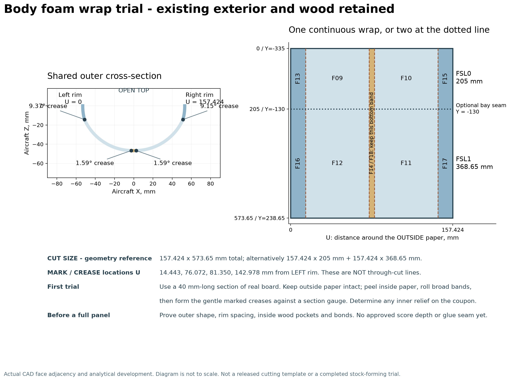

# Body foam: a concrete wrap method to trial

The forward and middle lower body can use **one continuous outer-paper wrap, 157.424 x 573.650 mm**, without moving the existing wood or changing the intended exterior. Alternatively, use two wraps: 157.424 x 205.000 mm and 157.424 x 368.650 mm. This is a geometrically proved reference development, not a released cutting order. Actual stock forming, inner relief and adhesive joints still need a representative trial.

## Geometric proof

FSL0 and FSL1 each have four cylindrical outer bands and one planar band, all extruded parallel to aircraft Y. Every neighbouring pair shares a real longitudinal topological edge. Cross-sectional edge lengths equal face area divided by span within 0.000000003 mm. Their common end profiles agree within 0.000000001 mm. At 75 sampled positions per delivered shell, points 0.1 mm inward lie inside the foam and points 0.1 mm outward lie outside.

The dimensions are therefore an analytical development of the existing OUTER paper surface, not a numerical stretch fit. Evidence is in body_wrap_geometry.json and proven_development.json. The continuous piece spans Y=-335 to 238.65. An optional transverse seam lies at Y=-130, 205 mm aft of its front edge.

The paper surface can develop without stretching, but its four transitions have real small corners. Rolling one perfectly smooth semicircle would change the profile. Preserve the marked gentle creases.

## Region order and marks

Define U from the aircraft's LEFT upper rim, around the bottom, to its RIGHT upper rim. Define V aft from the front edge at Y=-335. These are new pattern coordinates, not coordinates from the old individual DXFs.

| U interval, mm | FSL0 region, first 205 mm of V | FSL1 region, remaining 368.65 mm |
| --- | --- | --- |
| 0 to 14.443057 | F13 | F16 |
| 14.443057 to 76.071630 | F09 | F12 |
| 76.071630 to 81.349793 | F14 | F18 |
| 81.349793 to 142.978365 | F10 | F11 |
| 142.978365 to 157.423822 | F15 | F17 |

The four longitudinal MARK/CREASE lines are U=14.443057, 76.071630, 81.349793 and 142.978365 mm. Normal-direction changes are respectively 9.3653, 1.5940, 1.5940 and 9.1513 degrees. These are not through-cut lines or seams. Keep the 5.278 mm bottom band within the broad sheet.

The four curved bands have outside radii 54.940, 55.017, 55.017 and 53.431 mm. Nominal 5 mm material needs roughly 9% inner-core compression around these curves if the outer paper does not stretch. Thickness and paper behaviour matter.

## Trial sequence

1. Print outer_section_reference_1to1.svg at 100%. Measure its 100 mm check bar. Make a paper trial 157.424 mm wide and about 40 mm long. Mark LEFT, RIGHT, FRONT and the four U lines. Compare its outer profile with the reference. Upper rim separation is about 106.238 mm; bottom depth is 46.705 mm.
2. Cut a 40 mm-long trial from the actual foamboard. Mark the same positions on the inside. Leave a little extra width at each upper rim for final trimming; record that allowance separately from the nominal width. Measure actual thickness.
3. Peel the inside paper from the forming area while keeping the outside paper continuous. Work gradually. One-face removal changes strength and can cause warp, so the finished coupon and bond need testing on the same stock.
4. Pre-curve the four curved bands over a smooth former with its axis parallel to V. Keep the narrow bottom band flat. Control the result with the outside profile reference; a tool radius alone does not establish the finished shape.
5. Form the gentle marked creases. Start with controlled blunt creasing or compression on the inside. The two roughly 9-degree transitions need more definition than the two 1.6-degree bottom transitions. If foam bunches, trial a narrow inner V relief while preserving the outer paper. Record the depth and width that work. Do not apply a generic 50%-score rule or cut through to daylight.
6. Check the coupon at both ends. Reject torn paper, delamination, uncontrolled buckling, an unintended sharp ridge or a shape that requires force to hold. Repeat after a representative adhesive joint has cured. An exact knife depth cannot be prescribed for an unmeasured laminate.
7. Once the coupon works, choose one continuous wrap or two shorter wraps. Mark V=205 even on the continuous piece. Pre-form before fitting. Transfer real wood contacts and existing openings onto the inside. Do not bridge intentional cavities with glue or force the wood outward.
8. Dry-fit against existing former pieces, including FF0L/R at the forward/middle boundary, FF1 and the FF2L/R region. Keep upper rims and removable covers positioned as references. Mark and pare inner pockets gradually, then refit. No new wood cuts are proposed.
9. Bond only after the full dry-fit and access checks. Use the foam-compatible adhesive proved on the coupon, thin fitted joints and removable holding tape or fixtures. Keep N1/FSU1 and the other service covers removable. Recheck the shape after curing.

The [FliteBoard supplier](https://www.vortex-rc.com/2016/10/20/fliteboard-lightweight-paper-laminated-foamboard-rc-planes-india/) describes peeling one facing for curves and using score/bevel methods, while explaining the facing's structural role and possible warp. It does not qualify the owned batch or define these Reaper relief depths. Its nominal 5 mm wording and 5.5 mm Pro specification reinforce the need to measure actual stock.

## Remaining body mating sequence

| Region | Actual order | Limit |
| --- | --- | --- |
| Lower nose | FNG1, FNG2, FNG3, FNG4 from left rim around the bottom to right rim | Generated angular bands establish this order. Fit their aft edges against FSL0 at Y=-335 and trial the actual N1 interface. FNT closes the very front. Bevels remain a stock trial. |
| Forward/middle lower body | F13/F09/F14/F10/F15, then F16/F12/F18/F11/F17 | The broad wrap above replaces these seams after a successful forming trial. The two-piece option retains a transverse joint at V=205; the one-piece option removes it. |
| Rear lower body FSL2 | F19, F20, F33, F21, F22 from left rim around bottom | All four neighbours share source CAD edges. This region varies along Y; a constant-width replacement has not been proved. Do not delete F33. |
| Aft lower body FSL3 | F27, F28, F29, F30 from FRONT to REAR | These are successive cross-body bands, not four left-to-right strips. Source UV intervals are 0-.25, .25-.5, .5-.75 and .75-1. Seams lie near Y442.8, 495.7 and 548.3, but are not established as straight station cuts. |
| Front upper cover FSU1 | F25 meets F26 along the crown | Confirmed shared 130 mm longitudinal edge. Keep the cover removable with N1. |
| Rear upper cover FSU2 | F23 meets F24 along the crown | Confirmed shared curved edge about 156.102 mm long. Keep the cover removable. |

For separate pieces, mate their OUTER paper edges dry first. Remove interfering inner foam gradually so the outside stays flush. Mark each mating edge before glue. No universal 45-degree bevel is justified because curvature and adjacent surface normals vary. Holding tape must also be tried on the actual facing.

## Remaining limits

Ready for a local trial: exact broad-wrap outside dimensions, actual face order, crease locations and angles, a 1:1 outer-section reference and a sequence retaining the existing wood. Ten FSL0/FSL1 patterns can geometrically become one or two manufacturing blanks while preserving the two finished reference regions.

Not ready for a public cut/score file: validated relief depths, a finished contour tolerance, complete pocket marks, proved seam/bond details or a successful full-length stock trial. No CAD, wood profiles, released foam patterns, public counts or guide files changed. Wing construction is outside this task.
