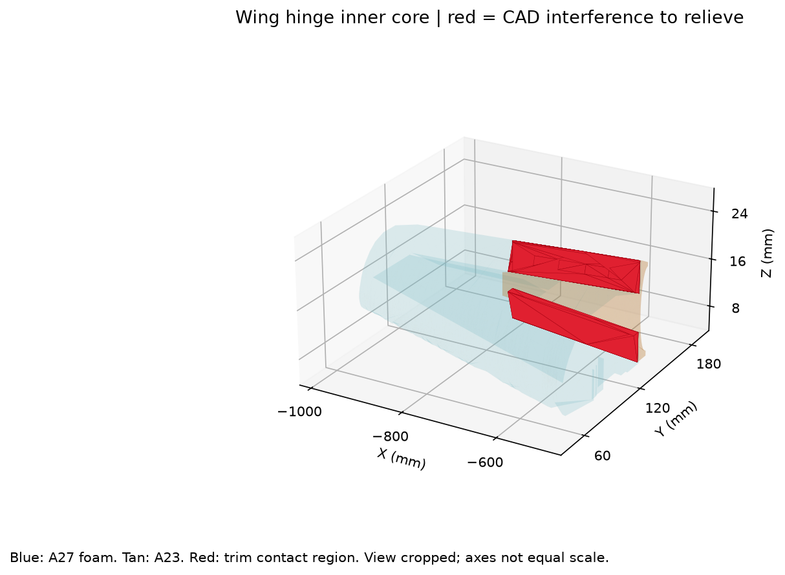
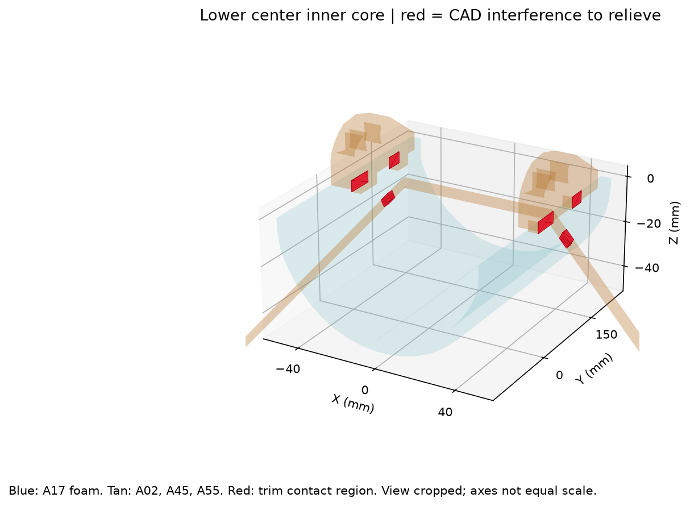
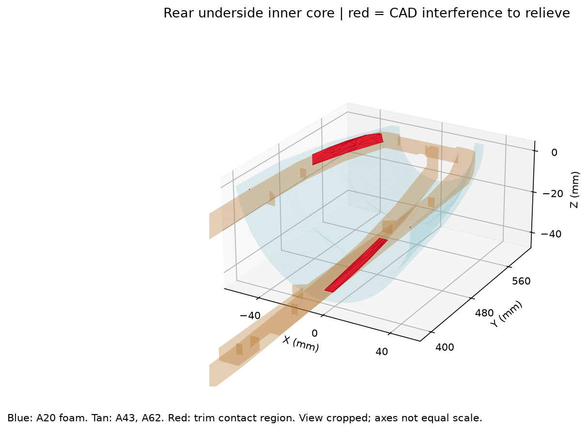

# Foam fabrication method and verification

## Design basis

These are quantitatively developed manufacturing surface patterns from the original CAD, in millimetres, without changing scale. They are not top-view wing outlines. Use the confirmed **FliteBoard Pro, 5 mm paper-faced XPS, 400 GSM, 1000 x 600 mm sheets** for the skins. The supplied pack contains ten sheets. The lower forward/middle CAD shell has concentric inner/outer cylindrical faces separated by 5 mm. Tail control surfaces have two parallel broad faces 10 mm apart and 5 mm radius edge surfaces; make each from two laminated 5 mm layers. 400 GSM is an areal mass specification, not a thickness. Measure actual stock thickness and check its batch tolerance against 5 mm before fitting. Do not resize the patterns to accommodate another thickness.

The manufacturing reference is the **preserved outside paper**. On curved skins remove the inside paper, progressively relieve/compress the inner foam, and keep the outside paper intact. Removing inner paper reduces panel stiffness and can cause warp: dry-form and bond to the ribs/formers promptly, restrain the panel symmetrically while adhesive cures, and add compatible paper/tape reinforcement across internal seams. Do not assume this reproduces the stiffness of intact two-paper board. This brings the bending reference close to the CAD exterior. It is not a conventional mid-thickness neutral-axis bend calculation. Leaving both paper skins intact and forcing a tight curve is a different process and will not preserve these dimensions. A paper-faced foam material that cannot form this way requires a new process qualification, not scaling.

## Cutting, seams and allowances

DXF units are mm. CUT is a full-depth knife outline. REFERENCE and LABEL are pen marks, not laser cuts. No kerf compensation is embedded: a knife follows the line; a shop using another qualified process applies its measured tool compensation. Default to knife cutting this XPS board. Use a laser only if the institution explicitly approves this exact XPS product and its extraction/process. Avoid CA adhesive unless the adhesive manufacturer explicitly confirms XPS compatibility; qualify a compatible adhesive on scrap.

Skin CUT lines are finished outer-paper seam lines: **zero lap allowance and zero trim allowance**, except the explicitly supplied 1 mm paper-only lower-edge trim lips on F23/F24. The REFERENCE outline on those two parts is the nominal exterior face: remove foam from the added lip, retain the paper and trim/form it to close the tiny shoulder return against the adjoining lower-shell lip. This is not an extra 5 mm foam strip. Butt adjacent outer-paper edges; relieve only the inside foam to clear its neighbour, and tape/glue the inside. Add separate 15 mm wide scrap-paper seam straps where accessible, nominally 7.5 mm each side of the join; these straps are not additional dimensions on the outside skin. Do not double the skin at seams. At a curved junction, shave the inner foam gradually to the actual dry-fit angle while preserving the finished outside edge. A universal 45-degree bevel is not appropriate for these changing tangent angles. Knife and glue gaps are established on the forming coupon.

Tail control CUT outlines include **5 mm sacrificial shaping stock all around** the nominal broad-face REFERENCE outline. Cut quantity two for each control, laminate to 10 mm total, transfer the reference outline and fit the original end planes, then shape the cylindrical long edges to radius 5 mm. The 5 mm all-around blank extension is sacrificial stock, not extra flight-control span or chord. Final control shape must follow the supplied original control CAD. Do not glue a control to a fixed stabilizer or bridge the hinge clearance with a skin strap.

The rear underside is divided into four bands along the CAD surface parameter v. These are deliberate relief seams, not stock-size scaling. The manifest records each panel source and zero-based CAD face. Original CAD surface boundaries provide the other panel seams. Corresponding source XYZ points identify mating surfaces; use the Reconstruction CSVs and the numbered corner marks, not PDF page edges, to locate parts. Letter A/B identifies a source occurrence, not an assumed left/right orientation: match the source STEP to the assembly mapping.

## Forming and assembly sequence

1. Verify stock thickness with callipers and make a 100 mm printed scale check in both directions. Print PDF at Actual Size / 100%, disable fit/shrink. The index page has a 100 x 20 mm calibration rectangle; check both directions before printing the complete set. The optimized PDF uses 5 mm hard margins and groups multiple IDs into six posters. Tape only pages with the same S-number, using their row/column labels, matching crosses and 10 mm overlap; do not align by printer paper edges. The index identifies every pattern that is whole on one page. Use the F31/F32 paper templates twice for their two laminate layers.
2. Cut a scrap coupon with a preserved outside paper skin, peel its inside paper and practice forming over the tightest intended nose/leading-edge curve. Gradually remove or compress inner foam. The outside paper must remain continuous, uncracked and close to the CAD surface. Establish glue and seam behaviour here before cutting the final board.
3. Build and align the corresponding CAD ribs/formers and spars first. Check the original assembly's span, root/tip chord and incidence. Skins are surface coverings; the unfolding calculation does not establish structural adequacy.
4. Trace and cut each numbered panel. Transfer its registration marks. Mark OUTSIDE on the paper before peeling inside paper. Keep mirrored source occurrences separate.
5. Dry-form wing skins over their matching rib set from the leading-edge region toward the open/trailing seam. Press progressively along the span, avoiding local paper tension. Relieve inner foam where it interferes with ribs or tight curvature. Do not pull a short seam into place by stretching the outside paper.
6. Dry-form each fixed tail skin using the three removable split collars in `Tail_Forming_Profiles.pdf` and `TOOLING_DXF`. They are derived from the actual trimmed CAD solid; use T03 at 6.84 mm from the root, T02 at 171 mm, and T01 at 335.16 mm along the 342 mm span axis. Use stiff card or 3 mm scrap plywood, align their planes on a straight jig board, then remove both halves after the skin seam adhesive cures. No internal fixed-tail ribs were present in the source, so these are temporary external forming tools, not existing aircraft structure. Respect the separate moving control's hinge line and required clearance; fit and test control travel before closing.
7. Fit lower forward and middle fuselage pieces on the matching formers. The narrow side and centre strips are explicit parts, not extra trimming waste. Match the broad cylindrical pieces to those strips using their source face boundaries.
8. Fit the aft lower and upper panels. Install the four rear-underside bands in parameter order 1 through 4, dry-matching both boundaries of each band before gluing. Support each seam internally. Small boundary differences from the numerical approximation must be distributed through dry forming; do not accumulate them at one end.
9. Laminate and shape the two tail controls as described above. Dry-fit hinges and full travel, then fit servo linkages. Protect hinge gaps from glue and covering.
10. Close skins only after checking access, wires, spar fit, control motion and mass/balance provisions. Weigh finished panels and the complete airframe. The digital checks do not constitute a flight release.

## Numerical method and evidence

The exterior STEP faces are tessellated with a explicit absolute 0.2 mm deflection / 0.15 rad angular tolerance (`BRepMesh_IncrementalMesh` with relative meshing disabled). Cylinders use the exact development x=radius*u, y=v. Their reported comparison to 3D mesh chords includes arc-versus-chord difference; the continuous cylinder itself has zero intrinsic development strain. Other surfaces use nonlinear least squares of intrinsic mesh edge lengths, with the actual absolute-mesh edge lengths as constraints. The final pattern preserves the CAD surface approximately; it is not a claim that compound-curved foam can become exactly flat without strain.

Compound rear bands are clipped from the same parent surface mesh, preserving shared 3D seam vertices. The output lists every flat vertex, corresponding source XYZ/UV and triangle connectivity. Edge residuals are recalculated from those actual exported coordinates. Final checks include a simple non-self-crossing boundary, no reversed triangles, each panel fitting a 1000 x 600 mm stock rectangle, and less than 0.5% maximum mesh-edge length change (final maximum 0.3665%). This is a numerical design tolerance, not a measured foam strain limit. The CSV/JSON manifest includes 99th-percentile edge error and maximum absolute edge error. Surface interpolation and physical forming introduce additional error; inspect the dry fit rather than relying solely on the percentage.

## Scope and remaining physical checks

Original CAD is preserved. These files cover exterior wing and fixed-tail skins, the identified fuselage shell surfaces, and the two 10 mm laminated tail-control blanks. Printed transitions, nose, hinges, wood structure, spars and hardware are covered by the main fabrication package rather than these skin files. No aerodynamic, structural, adhesion or flight performance has been established by unfolding. A shop can cut the patterns at scale and make the specified forming coupon; the builder must inspect actual material behaviour and dry fit before committing the full airframe.

Tail skins are each divided at normalized CAD span parameter v=0.8. Panel rootcollar1 covers 0-0.8; rootcollar2 covers 0.8-1.0 at the root. This separates the root transition into a supported collar seam and avoids imposing its full curvature on one sheet. Assemble each matched pair on its CAD stabilizer shape before final trimming of interior foam.

## Required local core relief found in assembly

These CAD interferences are explicitly accounted for during dry fitting, before bonding skins. Use the supplied `Relief_Reference` STEP overlap volumes and illustrated views to locate each zone. They are nominal CAD overlap references; actual removal is fitted against the real component. Do not subtract the entire component bounding box from foam.

- **Outer wing A27 / hinge rail A23**, and the opposite **A38 / A36**: locally relieve the inner foam under the hinge rail. For A23 the assembly footprint is approximately X -770.294 to -495.881, Y 127.001 to 143.096, Z 6.119 to 22.767 mm (actual A27/A23 intersection bounds). The reference overlap volume locates the interference, not a full-depth rectangular hole. Lay the actual hinge rail in place, transfer its contact footprint to the inner foam, and shave only contact regions until the rail seats and its moving hinge runs freely. Keep the outside paper intact. Check the mirrored opposite rail by the same method; do not assume separated-source coordinates are assembled coordinates.
- **Lower centre skin A17 / landing gear A02**: the gear exit needs a local through-opening. Trace the actual fixed leg where it crosses the skin, cut only that exit, and provide an initial 0.5 mm cutting clearance on each side. This is an assembly clearance, not a demonstrated landing-deflection clearance. Check full gear deflection on the ground with the aircraft supported and enlarge only as required so the skin does not carry gear load. Reinforce the paper around the exit with compatible paper/tape bonded to sound surrounding skin; preserve access to the actual structural gear attachment.
- **Lower centre skin A17 / root brackets A45 and A55**: mark each actual bracket contact patch on the inside and relieve only the inner foam. Preserve the exterior paper. Do not sand down structural brackets or wood to make the skin fit.
- **Rear underside A20 / longitudinal wood A43 and spine A62**: dry-assemble both wood members before fitting rear bands F27-F30. Transfer contact patches into the inner foam and relieve progressively. Preserve the outside paper and avoid routing a relief across the rear-band paper seam without a separate interior paper/tape bridge.

After these operations, repeat the dry assembly with all affected parts installed simultaneously. A skin can fit each neighbour independently while still binding when the complete stack is assembled. Re-laminate compatible paper/tape at inner seams and relieved-zone borders after the geometry fits; avoid adding material that recreates the collision. The stiffness of peeled/relieved foam has not been established by the CAD check.

## Final absolute-mesh audit

The earlier relative-meshing trial was rejected and is not included. Every released pattern has been regenerated from an explicit absolute 0.2 mm surface mesh. The `Surface_Mesh_Validation.json` report compares mesh area with adaptive CAD surface integration and samples the centroid and all three edge midpoints of each triangle against the exact STEP surface. Maximum sampled normal departure is 0.19971 mm. This is a sampled geometric check, not a full Hausdorff-distance proof. Maximum area difference is 0.315% for the complex rear shell; other curved parents are within 0.068%. Added tail collar seams have matching developed lengths; the largest rear-band seam mismatch is 0.02667 mm.

## Assembly map and exterior-face coverage

Use `Foam_Assembly_Map.pdf` and `Foam_Assembly_Mapping.csv` to locate all 33 pattern IDs. The aft-lower shell A42 has five pieces around its underside: F19 > F20 > F33 > F21 > F22. F33 is the real narrow bottom strip; do not omit it. `Source_Face_Coverage.csv` records the route for every face of the foam source components. Interior faces and material-thickness edges are not additional skin panels. A15 sub-millimetre outer shoulder returns are covered by the paper-only trim lips on F23/F24.

The fixed-tail forming templates confirm there is no useful cavity after a nominal 5 mm inward offset. Shape and relieve the two foam walls so they meet inside while retaining the outside paper; do not add unmodelled internal ribs. The external split collars are removed after cure.

## Efficient paper printing

The foam template PDF now contains 22 cutting pages plus one index (23 total), replacing the earlier 72-page layout. All 33 source DXFs are unchanged. Every pattern that fits a single usable A4 page is complete on at least one indexed page. Small pieces occupy clear spaces outside the large wing/tail cut polygons. The tail-tooling PDF uses one instruction page and one shared cutting page (2 total); all six removable collar halves are whole on the cutting page. `Foam_Paper_Layout.csv` and the fit/registration verification files record placements and source-to-PDF checks.
