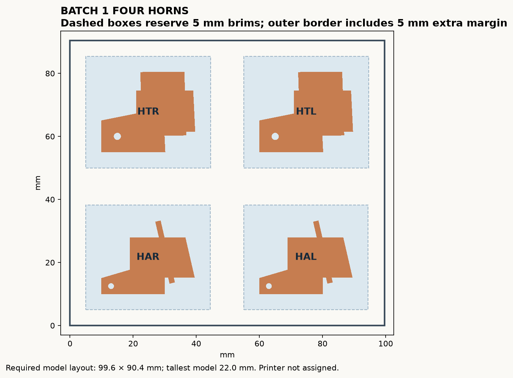
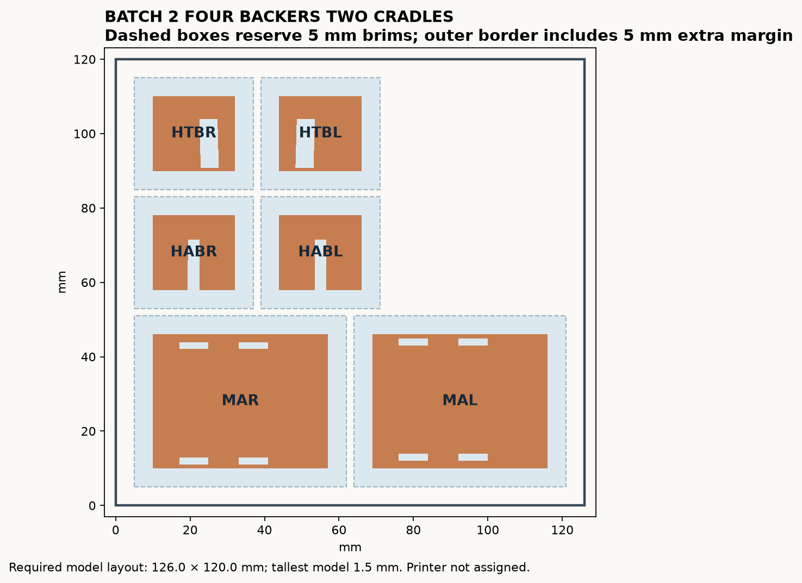

# Print ten small parts in two batches

Use the two **model-only 3MF files** below. They contain the revised foam-control horns and backers, plus the two unchanged servo cradles. Do not use the earlier six-part candidate or add these individual STL files again.

| Batch | File | Contents | Reserved space |
|---|---|---|---|
| 1 | Batch_1_Four_Horns_MODEL_ONLY.3mf | HAR, HAL, HTR, HTL; one each | 100 × 91 mm bed; 23 mm model height |
| 2 | Batch_2_Four_Backers_Two_Cradles_MODEL_ONLY.3mf | HABR, HABL, HTBR, HTBL, MAR, MAL; one each | 126 × 120 mm bed; 2 mm model height |

Each named object comes from the identically named STL. Plate 1 preserves the horn print orientation. Plate 2 keeps all broad faces down; the cradles are turned 90 degrees in the bed plane. No part is scaled.

## Apply these settings in the slicer

The 3MF files contain geometry and object names only, **not printer or material settings**. Select the actual printer and PLA+ profile, import at 100%, retain separate objects and print by layer, not sequentially one object at a time.

| Parts | Nozzle / layer | Walls | Infill | Supports | Brim |
|---|---|---:|---|---|---:|
| Four horns | 0.4 / 0.2 mm | 3 | 100% rectilinear | Enabled, including support from model surfaces; accessible external scaffolding | 5 mm |
| Four backers | 0.4 / 0.2 mm | 3 | 100% rectilinear | Off | 5 mm |
| Two cradles | 0.4 / 0.2 mm | 2 | 5% gyroid | Off | 5 mm |

Use no surrounding skirt for the stated reserved footprints. If the shop uses one, a purge line, bed clips or excluded zones, allow extra space. The diagram reserves 5 mm brim envelopes plus 5 mm outer margin. Horn supports also extend beyond their model footprint; inspect the actual sliced support boundaries before printing. Keep 4 top and 4 bottom layers for the reference horn/backer settings. The thin backers and cradle floors may be mostly solid layers regardless of nominal infill.

## Check before starting

Preview every layer. Horn webs sit above the bed on accessible supports; remove those supports and the brim before fitting, without damaging the thin flange or spoke hole. Backers lie flat and need no support. Check the real support-removal gap and adhesion on the shop profile. Do not disable required horn supports just to save material.

The owner reports that N1 printed whole with at least 20 mm clearance on every side. Its actual print orientation is not recorded. **If** it used the upright reference orientation, the nose footprint plus that clearance implies at least 149.03 × 128.55 mm in XY, enough for either small batch. This is a conditional comparison, not a printer specification. The real usable bed and height must still be checked in the workshop.

## Other files

AR, AL, TRC and TLC are now foamboard moving controls: do not print them. FCF, FTF, AHR and AHL are outside these batches. Existing N1 is not a new print order. The fixed rails still need about 274.1 mm usable height in their reviewed orientation, plus printer allowances; the nose report alone does not prove that height. Laying rails down would require a new support/toolpath review.

## Evidence and limits

Both saved 3MF files were reopened. Ten named build objects preserve their source triangle geometry; exact duplicate STL vertices are indexed together for valid 3MF topology. PrusaSlicer 2.9.6 reports each as one manifold part. The eight new horn/backer STLs were sliced byte-for-byte with the stated reference settings: no slicer warnings. Representative horn top and side toolpaths show external supports beneath the raised webs. Installed-model estimates exclude support/brim waste; they are not measured masses.

These files provide model layouts, not machine G-code. Actual material strength, adhesion, support removal, hardware fit and loaded control testing remain workshop checks.
